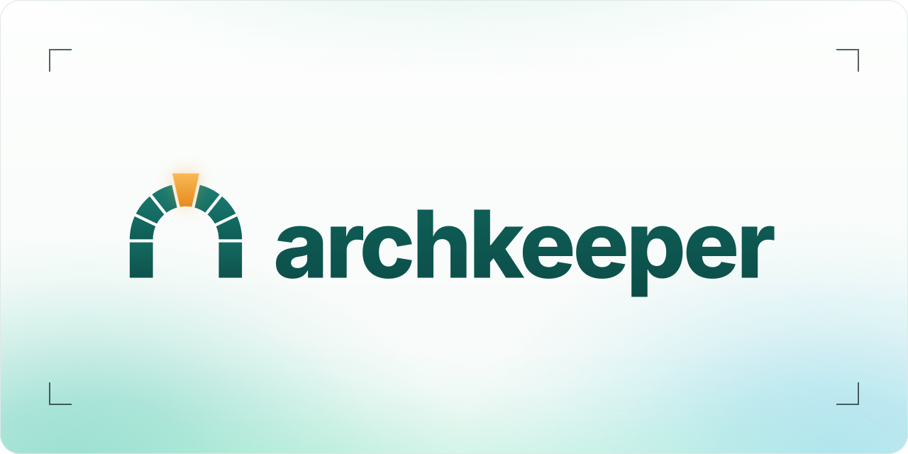
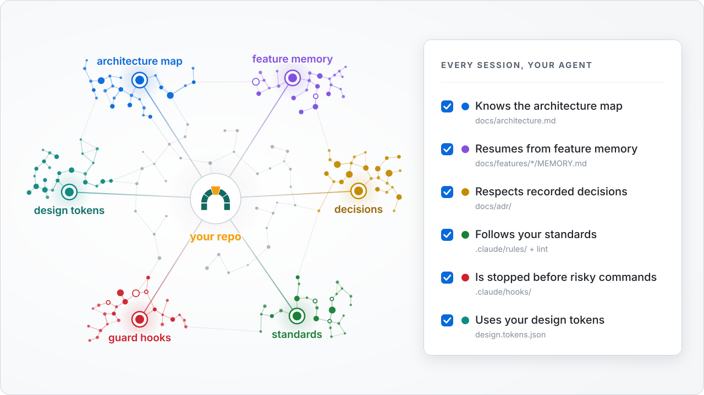

<p align="center">
  <picture>
    <source media="(prefers-color-scheme: dark)" srcset="docs/media/banner-dark.svg">
    
  </picture>
</p>

<p align="center">
  <a href="https://www.npmjs.com/package/archkeeper"></a>
  <a href="https://github.com/arbindpd96/archkeeper/actions/workflows/ci.yml"></a>
  <a href="LICENSE"></a>
  <a href="docs/adr/0011-single-package.md"></a>
  <a href="docs/adr/0011-single-package.md"></a>
  <br>
  <a href="docs/ROADMAP.md"></a>
  <a href="docs/ROADMAP.md"></a>
  <a href="#works-with"></a>
  <a href="CONTRIBUTING.md"></a>
</p>

<h3 align="center">Your AI coding agent never forgets your architecture, your decisions, or your design system.</h3>

Run `npx archkeeper init` in any repository and your agent stops rewriting code that already exists. archkeeper gives Claude Code a **living map of your codebase**, **memory that survives compaction**, and **standards it cannot skip**. The same rules reach Codex, Cursor, Gemini CLI and Copilot through `AGENTS.md`.

- **Knows what already exists.** A living architecture map loads in every session, so the agent extends your code instead of writing a second copy of it.
- **Remembers why.** Per-feature memory and decision records survive long sessions and `/compact`, and the agent will not quietly undo a decision you recorded.
- **Enforced, not suggested.** Standards run as linters and hooks. Guard hooks stop destructive commands and leaked secrets before they run.
- **Light and safe to update.** Zero runtime dependencies, `small` / `medium` / `full` presets, and updates that never overwrite your edits.

> [!NOTE]
> **archkeeper is pre-release and built in the open.** The npm name is reserved, and `npx archkeeper` prints a notice until **v0.1**, the first usable release. Follow the [roadmap](docs/ROADMAP.md) or watch the repository to know when it lands.

<p align="center">
  <picture>
    <source media="(prefers-color-scheme: dark)" srcset="docs/media/hero-dark.svg">
    
  </picture>
</p>

<p align="center"><i>What archkeeper sets up in your repository. Every part is a plain file you can read and edit, and every session starts with all of it loaded.</i></p>

## Quick start

<p align="center"></p>

```bash
npx archkeeper init             # detect the stack, show the plan, ask, then write it
npx archkeeper init --dry-run   # print the plan as a unified diff and write nothing
npx archkeeper init --yes       # no questions, as in CI; also --preset, --stack, --modules
```

Your own lines in CLAUDE.md and AGENTS.md stay as they are: the kit writes only its managed blocks, and a file it would replace gets a sidecar instead. Exit codes: 0 done, 1 error or cancelled, 2 done with sidecars to review. Then restart Claude Code and run `/new-feature checkout-flow`.

That's it. You get:

```text
your-project/
├── CLAUDE.md                  imports AGENTS.md, adds Claude-specific notes
├── AGENTS.md                  one set of rules for every AI tool
├── .claude/
│   ├── settings.json          permissions and hook registration
│   ├── hooks/                 guards, session memory, format-on-edit
│   ├── rules/                 path-scoped standards for each language
│   └── skills/                /new-feature  /handoff  /update-map  /why  /adr
└── docs/
    ├── architecture.md        the living map: what exists and where
    ├── decisions.md, adr/     why things are the way they are
    └── features/<name>/MEMORY.md   goal, decisions, done, next step
```

`update` merges new versions into these files and never overwrites your edits. `uninstall` removes everything it added.

## Works with

**Claude Code** gets the full setup: hooks, skills, rules and memory. **Codex, Cursor, Gemini CLI and GitHub Copilot** read the same rules from `AGENTS.md`. archkeeper also composes with workflow tools such as [Superpowers](https://github.com/obra/superpowers) and [Spec Kit](https://github.com/github/spec-kit) instead of replacing them.

## What's coming

| Phase                       | You get                                                                                                       |
| --------------------------- | ------------------------------------------------------------------------------------------------------------- |
| **v0.1** Foundation         | `init` for TS/JS and Python, guard hooks, feature memory, the architecture map, safe `update` and `uninstall` |
| **v0.2** Trust and proof    | 3-way updates, a `doctor` health score, standards packs, a test guard, benchmarks                             |
| **v0.3** Public launch      | The Claude Code plugin and marketplace, ready-made agents, design tokens                                      |
| **v0.4** Design-system sync | Live Figma and Storybook sync, accessibility and dark-mode checks                                             |
| **v0.5 – v1.0**             | Codebase intelligence, workflow skills, a local dashboard, more languages, team features                      |

The full plan with milestones and exit criteria is in [docs/ROADMAP.md](docs/ROADMAP.md). Each feature gets a short demo GIF in this README when it ships.

## Contributing

Contributions are welcome. Start with [CONTRIBUTING.md](CONTRIBUTING.md); the architecture map is in [docs/architecture.md](docs/architecture.md) and the decisions behind it are in [docs/decisions.md](docs/decisions.md). Please report security issues privately as described in [SECURITY.md](SECURITY.md).

## License

[MIT](LICENSE). Independent community project; not affiliated with, endorsed by, or sponsored by Anthropic. Claude and Claude Code are trademarks of Anthropic, PBC.
