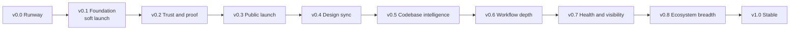

# Roadmap

> Your AI coding agent never forgets your architecture, your decisions, or your design system.

`archkeeper` is an npx CLI and a Claude Code plugin, built from one source of truth. Together they set up a modular, merge-safe Claude Code configuration in any project and keep it current. This document is the phased execution plan as of 2026-10-09.

- Decisions: [`docs/decisions.md`](decisions.md)
- Verified Claude Code facts: [`docs/research/claude-code-reference.md`](research/claude-code-reference.md)
- Live progress: [GitHub milestones](https://github.com/arbindpd96/archkeeper/milestones) (one per phase) and their issues

**Name.** The product, npm package, CLI and plugin are all `archkeeper` ([ADR-0010](adr/0010-rename-to-archkeeper.md)).
The slug lives only in `src/core/brand.ts` (ADR-0012). The state dir `.archkeeper/`, the managed-block markers
`<!-- archkeeper:begin <id> -->` and the hook folder `.claude/hooks/archkeeper/` all derive from it.

## How we work

- **One milestone, one PR.** Each milestone is one PR made of small, atomic Conventional Commits. Its issues are the PR's checklist and close when it merges. Push at every milestone.
- **Authorship.** The maintainer authors every commit on `main`, with no AI attribution. commitlint's `no-ai-attribution` rule already enforces the trailers.
  - CI never commits. It renders GIFs, stages releases and creates GitHub Releases.
  - Dependabot PRs are the one bot exception: dependency bumps keep `dependabot[bot]` authorship (proposed default, see open questions). AI attribution is never allowed.
  - Human contributors keep their own authorship.
- **Merge bar.** A PR merges by rebase once all of these hold:
  - `CI passed` is green.
  - The `reviewer` agent has reviewed the full diff.
  - The `security-reviewer` agent has reviewed the full diff.
  - Every finding from either agent is fixed, or answered in the PR.
- **Feature memory.** Each milestone starts with `/new-feature <name>`, which creates `docs/features/<name>/MEMORY.md`, and ends with `/handoff`.
- **The demo ships with the feature.** Every user-facing feature lands in the same PR as two things: a README section of five lines or fewer, and a GIF from `docs/media/tapes/<feature>.tape`.
  - Tapes use `{{brand.*}}` placeholders. They always go through `scripts/render-tapes.mjs`, never through `vhs` directly, so GIFs show the current command.
  - CI renders every tape against the packed CLI and uploads the GIFs as artifacts.
  - Tapes marked `# live` need a real Claude Code session. The maintainer records them locally with `/demo-gif`, using the VHS version and settings that CI pins.
  - The maintainer commits every GIF.
  - `check-demos` fails a PR when a feature's tape, GIF or README section is missing, or when a GIF is over its size or duration limit.
- **Decisions are ADRs.** To change an accepted decision, write a new ADR that supersedes it and update the old ADR's status line.
- **Lightness is measured.** `budgets.json` holds every size, dependency, latency and context budget, including context that hooks inject. CI fails when one is exceeded, and raising a budget needs an ADR note.
- **Dogfood.** From v0.1 M8 this repo runs on kit-generated files. CI fails on drift, and every release updates this repo first.
- **Sizes are relative scope, not dates.** S is one focused change, M is a substantial change with its tests, L is several milestones' worth.

## Phases at a glance

| Phase | Theme                          | Headline outcome                                                                                                                     | Size |
| ----- | ------------------------------ | ------------------------------------------------------------------------------------------------------------------------------------ | ---- |
| v0.0  | Runway                         | One zero-dependency package; GIF, staged-release and authorship pipelines; architecture ADRs accepted                                | M    |
| v0.1  | Foundation                     | `npx archkeeper init` sets up TS/JS and Python repos safely; update never overwrites; uninstall is clean; published; soft launch     | L    |
| v0.2  | Trust and proof                | 3-way updates, N-1 upgrade gate, doctor score and audit mode, standards packs, quality hooks, Superpowers install, benchmark harness | L    |
| v0.3  | Distribution and public launch | Plugin and marketplace, agents, Spec Kit composition, design-tokens lite, benchmark-gated public launch                              | L    |
| v0.4  | Design-system sync             | Live Figma and Storybook sync, design change alerts, `doctor --online`, UI checks, design launch wave                                | M    |
| v0.5  | Codebase intelligence          | Generated map index, code-graph MCP opt-in, impact, dead-code, API and DB maps, adopt mode                                           | L    |
| v0.6  | Workflow depth                 | Self-learning rules, lightweight planning, testing, git, docs and multi-agent skills                                                 | L    |
| v0.7  | Health and visibility          | Static dashboard, cost tracking, supply-chain and privacy checks, reports                                                            | M    |
| v0.8  | Ecosystem breadth              | More languages and frameworks, monorepos, other AI tools, design tools, integrations                                                 | L    |
| v1.0  | Stable                         | Frozen schemas, module trust model, trusted publishing, team features, shareable configs                                             | L    |

### Decisions this plan adds

| ADR  | Decision                                                                                                                                                   | Filed in |
| ---- | ---------------------------------------------------------------------------------------------------------------------------------------------------------- | -------- |
| 0011 | One published package, zero runtime deps, tsdown bundle, no workspaces. Supersedes ADR-0009's workspace clause                                             | v0.0 R1  |
| 0012 | Brand constants: the slug lives in one file, with `legacySlugs` for any future rename. The name itself is decided (ADR-0010)                               | v0.0 R1  |
| 0013 | Release: maintainer-run changesets, npm staged publishing, no provenance until npm/cli#9969 is fixed. Supersedes ADR-0009's release-automation consequence | v0.0 R2  |
| 0014 | On-disk contract and merge-safe lifecycle: config, lock v1, compressed base blobs, four strategies                                                         | v0.0 R3  |
| 0015 | Hook runtime and per-hook failure policy                                                                                                                   | v0.0 R3  |
| 0016 | Delivery split: what the CLI writes vs what the plugin carries; the plugin never ships hooks. Supersedes part of ADR-0002 Decision 2                       | v0.0 R3  |
| 0017 | Lightness budgets as a CI contract, including hook-injected context                                                                                        | v0.0 R1  |
| 0018 | No telemetry and offline by default (MCP reachability only under `doctor --online`), plus the benchmark methodology                                        | v0.0 R3  |

More ADRs will be written when their phase starts:

- the design-token file format (v0.3)
- the `.claude/agent-memory/` policy (v0.3)
- the dashboard as a static HTML file (v0.7)
- the schema freeze (v1.0)
- the third-party module trust model (v1.0)

---

## v0.0 — Runway (M)

**Goal.** Turn the toolchain-only repo into one npm package with zero runtime dependencies that can be built, released and demoed. Settle the architecture ADRs, so v0.1 is pure feature work and plumbing never blocks the first publish.

**Why now.**

- PR #1 lands the toolchain, but ADR-0009's npm-workspaces layout conflicts with reference §7.2 (one package, one cold `npx` fetch). This has to be settled before any `src/` code exists.
- The slowest external risk is the publishing blocker (npm/cli#9969), so the staged-publish path is built and dry-run now. (The name is already decided: ADR-0010.)
- The GIF pipeline has to exist before the first user-facing feature ships.
- Dependabot is already on, so its commits need a policy before `main` gets any of them.

### Milestones

**R1: Single-package layout and build (ADR-0011, ADR-0017).** The repo builds one zero-dependency bundle, and CI enforces layer boundaries and lightness budgets.

- [ ] docs(adr): ADR-0011 single published package with zero runtime dependencies
- [ ] chore(build): restructure to src/core, src/cli and src/hooks and drop npm workspaces
- [ ] feat(core): brand constants as the single source of the product slug
- [ ] chore(build): tsdown bundle for the CLI and per-hook scripts
- [ ] ci: package integrity gates and lightness budgets

**R2: Demo, release and authorship pipelines.** Tapes render in CI against the packed CLI, a release can be staged without trusted publishing, and `main` stays maintainer-authored.

- [ ] chore(examples): fixture projects for tests and demo tapes
- [ ] ci: demo-gifs workflow rendering brand-templated VHS tapes
- [ ] docs(adr): ADR-0013 release process with maintainer-run changesets and staged publishing
- [ ] ci(release): tag-triggered staged-publish workflow and docs/releasing.md
- [ ] chore(release): changesets for maintainer-run local versioning
- [ ] ci: commit-author check (no AI attribution; dependabot[bot] allowed for dependency bumps)

**R3: ADRs accepted, roadmap published.** The architecture is decided, and the plan is public.

- [x] docs(adr): ADR-0012 brand constants
- [x] docs(adr): ADR-0014, 0015, 0016 and 0018 for the on-disk contract, hooks, delivery split and no telemetry
- [x] docs(readme): launch-ready README skeleton with disclaimer and pre-release banner (done in #2)
- [x] docs: publish ROADMAP.md, GitHub milestones and v0.1 issues (this PR)

### Exit criteria (Definition of Done)

- **ADRs.**
  - ADR-0011, 0013, 0014, 0015, 0016, 0017 and 0018 are accepted.
  - ADR-0012 (brand constants) is accepted. The name was decided in ADR-0010.
  - Superseded status lines are updated, and so is `docs/decisions.md`:
    - ADR-0009: "workspace clause superseded by ADR-0011; release-automation consequence superseded by ADR-0013"
    - ADR-0002: "Decision 2 partly superseded by ADR-0016"
- **Build.**
  - `npm run build` emits `dist/cli.mjs` and the per-hook build.
  - `dependencies` is empty, and publint passes.
  - The `npm pack --dry-run` file list matches a committed snapshot.
  - Two builds produce the same sha256.
  - `dist/THIRD_PARTY_LICENSES.md` is generated.
- **Install smoke.** The packed tarball installs and runs `archkeeper --version` on ubuntu, macOS and Windows, from a path that contains a space.
- **Brand check.** `scripts/check-brand.mjs` passes in `npm run check`. The slug appears only in `brand.ts`, `package.json` and allowlisted docs.
- **Pipelines.**
  - `demo-gifs` renders `_smoke.tape` to a PR artifact of 2 MB or less.
  - `release.yml` passes a dry run.
  - `npm publish --dry-run` runs on every PR.
  - `commit-authors` is part of `CI passed`.
- **Planning.** ROADMAP is merged, GitHub milestones v0.0 to v1.0 exist, and every v0.1 issue is filed.

### README and demo

Only the README skeleton changes in this phase. It gets:

- the pitch and a pre-release banner
- the non-affiliation disclaimer
- empty hero and benchmark slots
- the Roadmap link

`_smoke.tape` exists only to prove the pipeline.

### Risks and mitigations

| Risk                                                                                | Mitigation                                                                                                                                                                                             |
| ----------------------------------------------------------------------------------- | ------------------------------------------------------------------------------------------------------------------------------------------------------------------------------------------------------ |
| tsdown 0.x and rolldown churn; the jsonc-parser bundling quirk                      | Pin exact versions, alias `jsonc-parser/lib/esm/main.js` (reference §7.1), and run a bundle smoke test in CI                                                                                           |
| The restructure breaks the just-merged toolchain (globs, coverage, comment checker) | Do it in one PR, and get `npm run check` green before any feature work                                                                                                                                 |
| Staged publishing can't be fully exercised before the package exists                | Dry run now; a real rc publish in v0.1 M9                                                                                                                                                              |
| VHS renders differ between CI and local machines                                    | Non-live GIFs come only from CI artifacts. Live tapes are recorded with the VHS version pinned in `demo-gifs.yml` and the shared `_settings.tape`, and `check-demos` checks size and duration for both |
| Bot or AI-tool commits reach `main`                                                 | `commit-authors` in `CI passed` fails them; `dependabot[bot]` may author commits only on its own grouped dependency-bump PRs                                                                           |
| The gh token lacks the `workflow` scope needed to push new workflow files           | `gh auth refresh -h github.com -s workflow` (reference §7.4)                                                                                                                                           |

---

## v0.1 — Foundation (L)

**Goal.** In an existing TS/JS or Python repo, `npx archkeeper init` writes a small, medium or full setup in seconds without clobbering anything. The setup contains:

- CLAUDE.md importing `@AGENTS.md`, and an AGENTS.md built on the Karpathy principles
- a per-feature MEMORY.md that Claude resumes after `/compact` and in new sessions
- decision records with `/why` (medium and full)
- a seeded `docs/architecture.md` with `/update-map` (medium and full)
- guard hooks for dangerous commands and secrets, backed by native deny rules
- format-on-edit (medium and full)
- a test check before "done" (full)

`init` also offers Superpowers and Spec Kit. `update` never overwrites user edits, `uninstall` restores the pre-init state, `doctor` validates the install, and this repo runs on the result.

**Why now.** This is the smallest release that is useful on its own and proves the pitch, and it is the only way to get real feedback. The lockfile, base blobs, markers and ownership model ship in the first release and are effectively permanent once users install them. So they are built carefully and exercised across two kit versions before 0.1.0 freezes them.

### Presets in v0.1

| Module                                                                                   | small       | medium      | full        |
| ---------------------------------------------------------------------------------------- | ----------- | ----------- | ----------- |
| base (CLAUDE.md, AGENTS.md, ignore rules, settings)                                      | yes         | yes         | yes         |
| safety (guard hooks, deny rules)                                                         | yes         | yes         | yes         |
| feature-memory (MEMORY template, mistakes log, memory hooks, `/new-feature`, `/handoff`) | yes         | yes         | yes         |
| knowledge (decisions, ADRs, glossary, `/why`, `/adr`)                                    |             | yes         | yes         |
| architecture-map (`docs/architecture.md`, `/update-map`)                                 |             | yes         | yes         |
| format-on-edit                                                                           |             | yes         | yes         |
| stop-check                                                                               |             |             | yes         |
| SessionStart context cap                                                                 | 1,200 chars | 3,000 chars | 4,000 chars |
| Always-on context budget (SessionStart counted at its cap)                               | 1.5k tokens | 3k tokens   | 4.5k tokens |

### Milestones

**M1: Core: module manifests, config, presets, renderer.** Modules are validated data covering files, hooks, permissions, MCP servers, preset membership and demo. Presets resolve deterministically, and templates render byte-identically on every OS and for any brand.

- [ ] feat(core): module manifest schema and loader
- [ ] feat(core): project config and preset/module resolution
- [ ] feat(core): deterministic logic-less renderer with an injectable brand

**M2: Core: install planner, ownership strategies, transactional apply.** Every write is:

- planned purely
- owned explicitly
- path-checked
- applied transactionally with a backup
- recorded with a hash and a compressed base blob

The first contact with existing user files loses nothing.

- [ ] feat(core): pure install planner
- [ ] feat(core): ownership strategies for blocks, json, owned and create-only files
- [ ] feat(core): path safety for every write and delete
- [ ] feat(core): transactional apply with lockfile v1, base blobs and rollback

**M3: Stack detection and `init` with the base module.** `init` works end to end. It detects the stack, shows the plan, writes CLAUDE.md and AGENTS.md without touching user content, and runs non-interactively in CI.

- [ ] feat(core): stack detection for TS/JS and Python
- [ ] feat(cli): bin entry, global flags and error output
- [ ] feat(cli): `init` command with interactive and scripted modes
- [ ] feat(modules): base module for CLAUDE.md, AGENTS.md, ignore rules and settings
- [ ] test: per-module snapshots, preset × stack golden trees and always-on context budget

**M4: Safety: hook runtime, guards and native deny rules.** Claude is blocked from destructive commands and from writing secrets, with prefix deny rules as a second layer.

- [ ] feat(hooks): shared hook runtime with self-test and per-hook failure policy
- [ ] feat(hooks): guard-bash PreToolUse hook
- [ ] feat(hooks): guard-secrets PreToolUse hook that fails closed
- [ ] feat(modules): safety module with any-depth .env deny rules

**M5: Feature memory and decisions.** Every session starts knowing the active feature's goal, decisions and next step, including the first turn after compaction. Past decisions are searchable.

- [ ] feat(modules): feature-memory and knowledge modules with their docs and skills
- [ ] feat(hooks): session-start, pre-compact and stop memory hooks

**M6: Map, format-on-edit, full preset and compose offers.** After this milestone:

- Claude sees what already exists.
- Every edit is formatted and linted with the project's own tools.
- All three presets exist.
- `init` offers the tools we compose with.

- [ ] feat(modules): architecture-map module and update-map skill
- [ ] feat(hooks): format-on-edit PostToolUse hook using local tools only
- [ ] feat(modules): full preset with an optional shell-free stop check
- [ ] feat(cli): init offers Superpowers and Spec Kit (print-only in v0.1)

**M7: Lifecycle: update, uninstall, doctor v0, e2e, live acceptance.** Users can take fixes safely, diagnose problems and leave cleanly. This is proven on the real tarball, across two kit versions and three OSes, and in a real Claude Code session.

- [ ] feat(cli): `update` with a never-overwrite policy, --check and --restore
- [ ] feat(cli): `uninstall` that restores the pre-init state
- [ ] feat(cli): `doctor` v0 install checks (read-only, offline)
- [ ] test(e2e): packed-tarball lifecycle with a two-version upgrade
- [ ] docs(testing): live acceptance checklist for a real Claude Code session

**M8: Dogfood.** This repo is developed on its own output, and CI keeps it there.

- [ ] chore(dogfood): migrate this repo to the kit-generated setup
- [ ] ci(dogfood): self-check job keeps this repo on the kit

**M9: Release 0.1.0 and soft launch.** The first npm release goes out through staged publishing, and early users get a feedback channel.

- [ ] chore(release): publish 0.1.0-rc.0 and 0.1.0 through staged publishing [gate]
- [ ] docs: README v0.1 pass, soft launch and feedback intake

### Exit criteria (Definition of Done)

- **Install.** `npx archkeeper@0.1.0 init --yes` succeeds on clean copies of the ts-app, py-app and mixed fixtures:
  - on ubuntu (Node 22/24/26), macOS and Windows (Node 24)
  - from a path with a space and non-ASCII characters
  - proven by both the packed-tarball e2e and the post-publish registry smoke job
- **Two-version e2e.** The run is: init with kit v1, scripted user edits, then `update` to a synthetic `kit-next`. It loses 0 user bytes, respects deleted files and applies the kit's changes. The fast-check property "no user byte lost" (at least 1,000 runs) is green.
- **Idempotent.** A second `init` or `update` plans 0 operations.
- **Uninstall.**
  - Where the kit created every file, `git status --porcelain` is empty afterwards.
  - A pre-existing `settings.json` or `.mcp.json` comes back deep-equal to the original, with comments preserved.
- **Hooks.**
  - Every hook passes `--self-test`, with p95 latency of 200 ms or less on ubuntu CI (formatter time excluded).
  - guard-bash passes at least 40 table cases, and guard-secrets passes its false-positive suite.
  - guard-secrets fails closed.
- **Generated config passes static checks** across every preset × stack combination:
  - CLAUDE.md is under 100 lines and contains a single `@AGENTS.md` import.
  - Hooks use exec form: `node` plus a script path.
  - There is no `once`, no `if` on non-tool events, no `autoMode`, no `permissions.defaultMode` and no model id.
  - `settings.json` carries `$schema`.
- **Presets and modules.**
  - Preset membership matches the table above, asserted by a test.
  - Every module has its own isolated snapshot, as ADR-0003 requires.
- **Lightness** (enforced from `budgets.json`):
  - tarball 300 kB or less, 0 runtime deps, each hook bundle 30 kB or less
  - always-on context, including SessionStart output at its preset cap, of at most 1.5k / 3k / 4.5k tokens for small / medium / full
  - warm init under 2 s
  - no network access from init, update, uninstall, doctor or any hook (stubbed-network test)
- **State dir.** A test proves that nothing under `.archkeeper/` has a name Claude Code discovers, and that a ripgrep search for template text never matches there.
- **Doctor.** `doctor` reports zero errors on every fresh-init fixture.
- **Compose offers.** `init` offers Superpowers and Spec Kit, off by default. A yes prints the commands and records the choice. Nothing is installed or fetched.
- **Dogfood.** This repo runs on kit-generated files, and the CI self-check (`update --check` plus `doctor`) is green.
- **Gate and release.**
  - 0.1.0-rc.0 (tag `next`) and 0.1.0 were staged-published with maintainer 2FA approval.
  - The live acceptance checklist is ticked with the Claude Code version used.
- **README and feedback.**
  - Every section in the table below has its GIF, and `check-demos` is green.
  - The README has Requirements and the disclaimer.
  - The feedback intake is live.

### README and demo

Each section ships in its feature's PR. `live` tapes are recorded locally; CI renders the rest.

| Section                             | GIF              | Tape | Milestone |
| ----------------------------------- | ---------------- | ---- | --------- |
| Quick start (hero candidate)        | `init.gif`       | CI   | M3        |
| Safety                              | `guard.gif`      | live | M4        |
| Feature memory                      | `memory.gif`     | live | M5        |
| Decisions (`/why`, `/adr`)          | `why.gif`        | live | M5        |
| Architecture map (`/update-map`)    | `map.gif`        | live | M6        |
| Format on edit                      | `format.gif`     | live | M6        |
| Tests before done (full preset)     | `stop-check.gif` | live | M6        |
| Works with Superpowers and Spec Kit | `compose.gif`    | CI   | M6        |
| Doctor                              | `doctor.gif`     | CI   | M7        |
| Update and uninstall                | `lifecycle.gif`  | CI   | M7        |

M9 adds three more things:

- the presets and Lightness tables, generated from `budgets.json`
- Requirements: Node.js `^22.17.1 || ^24.4.1 || >=26` on PATH (ADR-0011; the same range runs the hooks), and Claude Code 2.1.277 or later
- the pre-release banner replaced with v0.1 status

### Risks and mitigations

| Risk                                                                                          | Mitigation                                                                                                                                                                                                  |
| --------------------------------------------------------------------------------------------- | ----------------------------------------------------------------------------------------------------------------------------------------------------------------------------------------------------------- |
| A merge bug destroys user content, which would be fatal to trust                              | Never overwrite (sidecars); transactional apply with backup and rollback; fast-check property; two-version e2e; `--dry-run`; committed base blobs; both review agents on every PR                           |
| The on-disk contract freezes at first publish                                                 | Name decided up front (ADR-0010); dogfood before publish; the kit-next e2e exercises the lock and bases across versions; `lockfileVersion`; `BRAND.legacySlugs` for later renames                           |
| Base or backup copies get loaded as instructions, or show up in searches and duplicate checks | Bases and backups are compressed, content-addressed blobs under names Claude Code never discovers; a test enforces it; the map seeder and (from v0.2) the duplicate checker skip `.archkeeper/`             |
| Claude Code behaviour drifts (hook schema, AGENTS.md import, compaction)                      | Live acceptance on every release; nothing from reference §12 is relied on; the event `source` is read defensively; doctor checks the version                                                                |
| Stop nudges or guard false positives annoy users                                              | At most one nudge per change set, and none without an active feature; ask rather than deny when ambiguous; false-positive suites; `--modules -safety` opt-out; repo-policy options off by default           |
| Windows exec, path and CRLF issues                                                            | Exec-form node hooks; Node tools via `process.execPath`; no shell and no `.cmd`/`.bat`; LF-normalised hashing; EPERM/EBUSY rename retries; a space and non-ASCII path matrix; a regression test for 6d2d423 |
| Python-only teammates have no node on PATH                                                    | Hook errors are non-blocking and the deny rules still apply; README Requirements; doctor v0 warns                                                                                                           |
| Scope creep delays the first release                                                          | Anything outside the v0.1 issue list goes to a later milestone at priority:p2                                                                                                                               |

---

## v0.2 — Trust and proof (L)

**Goal.** Make the kit safe to keep installed for months, and start proving its value. This phase adds:

- 3-way updates and a standing upgrade gate
- doctor score, audit mode and badge
- TS/JS and Python standards packs
- quality hooks, permission presets and module toggles
- a consented Superpowers install
- the benchmark harness

**Why now.**

- Once real users exist, every release must flow into their repos without loss, and v0.1 already recorded the bases that 3-way merge needs.
- Soft-launch feedback will centre on "is my setup healthy?" and "what changed?".
- The standards packs complete ADR-0006.
- The benchmark needs a working harness well before the public launch.

### Milestones

**M1: 3-way updates and upgrade safety.**

- [ ] feat(core): node-diff3 3-way merge for owned Markdown and managed blocks
  - Conflicts are written diff3-style with the base section inline (labels: yours / base / `archkeeper@<ver>`), or as `.rej` files with `--conflict rej`.
  - JSON never gets markers, and `.mjs` files keep sidecars.
- [ ] feat(modules): resolve skill for guided conflict resolution. It works from the inline base and never reads `.archkeeper/base/`.
- [ ] test(e2e): N-1 upgrade from the npm `latest` release, required by `release.yml`
- [ ] feat(core): config and lock migration chain

**M2: Doctor score, audit mode, badge and stale alerts.**

- [ ] feat(cli): doctor health score (weighted 0–100, `--json`, top fixes)
- [ ] feat(cli): doctor audit mode for any Claude Code repo (read-only, no lock needed)
- [ ] feat(cli): `doctor --badge` (static shields markdown, no network) and a weekly corpus job over about 25 pinned public repos
- [ ] feat(hooks): stale-file alerts for the map and feature memories

**M3: Standards packs for TS/JS and Python.**

- [ ] feat(packs): TypeScript and Python path-scoped rules in `.claude/rules/archkeeper/` covering complexity, naming, error handling and "why, not what" comments
- [ ] feat(packs): create-only linter configs when a project has none, and a printed suggested diff otherwise
- [ ] feat(packs): React, Next.js, Django and FastAPI rule files (good first issues)
- [ ] docs: pack authoring guide proving that adding a language is purely additive

**M4: Quality hooks.**

- [ ] feat(hooks): full test guard Stop hook (stack-derived default, diff fingerprint, block cap)
- [ ] feat(hooks): advisory duplicate checker PostToolUse hook (zero-dep index that skips `.archkeeper/`, never blocks)

**M5: Permissions, toggles and Superpowers.**

- [ ] feat(modules): permission presets strict / normal / relaxed. They add allow, ask and deny rules only, and print an `autoMode` snippet with `$defaults` for user settings.
- [ ] feat(cli): `modules enable|disable <id>`
- [ ] feat(cli): consented Superpowers install via `claude plugin install superpowers@claude-plugins-official --scope project`, with doctor overlap checks (ADR-0008)

**M6: Benchmark harness.**

- [ ] feat(bench): with-vs-without harness in `benchmarks/` (not published; workflow_dispatch only; budget cap)
- [ ] feat(bench): four scenarios with deterministic graders (decision recall, reuse, dangerous request, tokens and cost)
- [ ] feat(bench): no-API lightness benchmark that generates the README Lightness table

**M7: Release v0.2.0.**

- [ ] chore(release): v0.2.0 with the dogfood update

### Exit criteria (Definition of Done)

- **3-way merge.** `update` merges owned Markdown and blocks 3-way. At least 30 table cases (adjacent lines, CRLF, deleted-by-user) are green on 3 OSes.
- **Upgrade gate.** The N-1 upgrade e2e is a required `release.yml` job. Upgrading an install made by the published 0.1.0 loses 0 user bytes.
- **Doctor.**
  - It prints a stable 0–100 score with fixes in 3 s or less.
  - Audit mode runs read-only on a repo without the kit.
  - `--badge` makes no network call.
  - The corpus job has 0 crashes.
- **Standards.** Rules have yaml-validated `paths:`, invalid YAML cannot be emitted, and linter configs are create-only.
- **Quality hooks.**
  - The full preset adds the test guard and the duplicate checker.
  - The duplicate checker flags at least 80% of seeded duplicates, with at most 1 false positive per 100 edits, and never blocks.
- **Permissions and Superpowers.**
  - Permission presets never set `defaultMode` or `autoMode`.
  - Superpowers is installed only with explicit consent and recorded in config.
  - Overlapping kit skills are skipped, and a failed install never aborts init.
- **Benchmark harness.** It runs at least 4 scenarios × 2 arms × 5 runs against a pinned Claude Code version. A run is valid only if a hook log proves the hooks fired.
- **Demos.** Every item in the table below has its README section and GIF, and `check-demos` is green.
- **Release.** This repo is updated by the CLI first, and 0.2.0 is staged-published.

### README and demo

| Section                                               | GIF                | Tape | Milestone |
| ----------------------------------------------------- | ------------------ | ---- | --------- |
| Safe updates                                          | `update-merge.gif` | CI   | M1        |
| Resolving conflicts                                   | `resolve.gif`      | live | M1        |
| Doctor (refreshed: score, audit mode, badge)          | `doctor.gif`       | CI   | M2        |
| Stale-file alerts                                     | `stale.gif`        | CI   | M2        |
| Standards                                             | `standards.gif`    | live | M3        |
| Linter configs                                        | `lint-configs.gif` | CI   | M3        |
| Test guard                                            | `test-guard.gif`   | live | M4        |
| Duplicate checker                                     | `duplicates.gif`   | live | M4        |
| Permission presets                                    | `permissions.gif`  | CI   | M5        |
| Module toggles                                        | `modules.gif`      | CI   | M5        |
| Works with Superpowers (refreshed: consented install) | `compose.gif`      | live | M5        |

### Risks and mitigations

| Risk                                                 | Mitigation                                                                          |
| ---------------------------------------------------- | ----------------------------------------------------------------------------------- |
| diff3 marks adjacent-line edits as conflicts         | `excludeFalseConflicts`, small blocks, the resolve skill, `--conflict rej`          |
| The test guard slows every stop or loops             | Runs only when code changed; respects `stop_hook_active`; timeout; full preset only |
| Duplicate-checker false positives                    | Advisory only, top-3 matches, tuned threshold, fixture targets                      |
| Generated linter configs clash with team conventions | Created only when none exists; otherwise a suggested diff is printed                |
| Superpowers install fails or changes its command     | Consent first, a non-fatal failure, and the known-good version recorded             |
| Benchmark cost and noise                             | Budget cap, fixed prompts, deterministic graders, variance published                |

---

## v0.3 — Distribution and public launch (L)

**Goal.** This phase does four things:

- Ship the Claude Code plugin and marketplace from the same module sources.
- Add ready-made agents, and offer Spec Kit with consent.
- Make the design-system part of the pitch true through design-tokens lite.
- Launch publicly with benchmark evidence.

**Why now.** v0.1 and v0.2 proved the project-side core with real users. A public launch needs:

- the marketplace channel
- a with-vs-without benchmark chart
- the "compose, don't rebuild" story
- the whole pitch true on launch day: architecture, decisions and design system

Figma's native DTCG export means design tokens can ship without waiting on unverified Figma MCP details.

### Milestones

**M1: Plugin and marketplace (ADR-0002, ADR-0016).**

- [ ] chore(build): generate `plugin/` from module sources, with skills and agents only and **no hooks**
  - `plugin/` is committed only in release PRs, and CI asserts there that it matches the build.
  - CI fails any other PR that changes `plugin/` or `.claude-plugin/`, and CODEOWNERS names both paths (ADR-0016).
  - A root `.claude-plugin/marketplace.json` points at `./plugin`.
- [ ] ci: validate the plugin and marketplace with a pinned Claude Code CLI (`claude plugin validate --strict`, with a zod mirror as fallback)
- [ ] feat(cli): skill delivery `--skills local|plugin`, plus a doctor check for duplicate copies
- [ ] feat(cli): optional team onboarding settings (`extraKnownMarketplaces`, `enabledPlugins`), with consent and a note about workspace trust

**M2: Agents.**

- [ ] feat(plugin): reviewer, security-reviewer, planner, tester and docs agents
  - Each has explicit `tools` and `disallowedTools`.
  - The reviewer uses `memory: project`.
  - They replace this repo's hand-written agents.
- [ ] docs(adr): `.claude/agent-memory/` commit policy

**M3: Spec Kit composition (ADR-0008).**

- [ ] feat(cli): consented Spec Kit install
  - It runs before the kit writes skills, and its flags are probed with `specify init --help`.
  - `--force` is never passed without a second, warned confirmation.
  - The files it creates are hashed as foreign.

**M4: Design-tokens lite.**

- [ ] docs(adr): DTCG 2025.10 token file (`docs/design/design.tokens.json`) and import-first sync
- [ ] feat(design): DTCG schema, `tokens validate`, and `tokens import` from Figma's native variable export
- [ ] feat(design): design-system module with `design.tokens.json`, a DESIGN.md with a managed token table, a file-based `/sync-design` v1, and a path-scoped design rule
- [ ] feat(hooks): advisory hardcoded design-value hook (UI files only, 50 ms or less, never blocks)

**M5: Benchmark launch run.**

- [ ] chore(bench): launch run with at least 4 scenarios × 2 arms × 10 runs and a gate check. Raw JSONL, methodology and negative results are published, and the chart goes in the README.

**M6: Public launch.**

- [ ] docs(readme): launch README with a hero GIF of 30 s or less, the benchmark chart, the Lightness table, "Works with Superpowers and Spec Kit" and an FAQ
- [ ] chore: launch-week runbook and a rehearsed staged-publish hotfix path
- [ ] chore: contributor on-ramp with at least 10 good-first-issues, Discussions and a module-request template
- [ ] chore(release): v0.3.0, then the launch: the awesome-claude-code submission, Show HN, r/ClaudeAI, X, and the blog post "Why AI agents keep rewriting code that already exists"

### Exit criteria (Definition of Done)

- **Plugin.**
  - Plugin and marketplace validation pass in CI.
  - The plugin contains no hooks.
  - `/plugin marketplace add arbindpd96/archkeeper` followed by an install works in a live run.
- **Agents.** They ship with explicit tool lists, and the agent-memory ADR is accepted.
- **Spec Kit.** It is offered with consent and never silently passes `--force`.
- **Design tokens.** `design.tokens.json` validates against the kit's DTCG 2025.10 schema, and `tokens import` normalises a Figma native export fixture.
- **Demos.** Every item in the table below has its README section and GIF.
- **Launch gate.**
  - At least 5 external installs have reported back from the soft launch.
  - At least 2 benchmark scenarios improve with non-overlapping IQRs. Results are published whatever they show.
- **Launch.** v0.3.0 is released, and launch week ran per the runbook.

### README and demo

| Section                                | GIF                     | Tape | Milestone |
| -------------------------------------- | ----------------------- | ---- | --------- |
| Plugin install (and `--skills plugin`) | `plugin.gif`            | live | M1        |
| Team settings                          | `team-settings.gif`     | CI   | M1        |
| Agents                                 | `agents.gif`            | live | M2        |
| Works with Spec Kit (refreshed)        | `compose.gif`           | live | M3        |
| Design tokens                          | `design-tokens.gif`     | CI   | M4        |
| Hardcoded design values                | `hardcoded.gif`         | live | M4        |
| Benchmark chart and refreshed hero     | chart image, `init.gif` | CI   | M5–M6     |

### Risks and mitigations

| Risk                                             | Mitigation                                                                    |
| ------------------------------------------------ | ----------------------------------------------------------------------------- |
| Plugin schema or validator drift                 | Validator in CI with a pinned CLI; no hooks in the plugin                     |
| Benchmark results are weak or noisy              | The launch gate allows iterating; narrower claims; results published honestly |
| HN dismisses it as "another CLAUDE.md generator" | Lead with doctor-on-any-repo, safe 3-way updates and measured results         |
| Superpowers or Spec Kit commands change          | Runtime `--help` probes; known-good versions recorded                         |
| Launch-day bugs on unusual repos                 | Design partners and the doctor corpus before launch; rehearsed hotfix path    |

---

## v0.4 — Design-system sync (M)

**Goal.** Make live design sync the headline. This phase adds:

- Figma variables through the official plugin or MCP, with the export file as the fallback
- light and dark themes
- design change alerts
- `doctor --online` reachability checks for configured MCP servers (ADR-0007)
- UI checks for component reuse, accessibility, dark mode and responsive layout
- UI rule packs and a designer agent
- a Storybook adapter

Then run a second launch wave aimed at frontend and design audiences.

**Why now.** Design sync is the clearest gap in the market, and v0.3 already shipped the token format, the import path and the advisory hook. This is also the first phase where the kit configures an MCP server, so ADR-0007's reachability check lands here. The reference §12 unknowns (Figma MCP tools, Penpot) must be verified first.

### Milestones

- **M1: Research spike.**
  - [ ] docs(research): verify Figma MCP tools, auth and limits, plus Storybook and Penpot MCP; record a go/no-go per adapter
- **M2: Live Figma sync and themes.**
  - [ ] feat(design): `archkeeper design connect`, preferring `claude plugin install figma@claude-plugins-official` and otherwise writing a typed http entry with no secrets
  - [ ] feat(design): `/sync-design` via MCP with a file fallback, showing a diff before writing
  - [ ] feat(design): themes (`design.resolver.json`) and a Figma export profile (px, seconds, a single fontFamily)
- **M3: Design change alerts and MCP health.**
  - [ ] feat(design): token drift alerts in SessionStart (within the preset cap) and doctor; `sync-design --check` exits 1 in CI
  - [ ] feat(doctor): `doctor --online`, an explicit opt-in. Each configured MCP server is reported as reachable, needing auth, or unreachable, with a fix.
    - http servers get an MCP initialize request with a 5 s timeout.
    - stdio servers are checked by resolving their command.
    - Secrets are never sent or printed, and plain `doctor` stays offline.
- **M4: UI checks and rules.**
  - [ ] feat(design): component reuse check
  - [ ] feat(design): accessibility checks (alt text, labels, WCAG AA token contrast)
  - [ ] feat(design): dark mode and responsive checks
  - [ ] feat(packs): animation, icon and image, and UX writing rules
  - [ ] feat(plugin): designer agent
- **M5: Adapters.**
  - [ ] feat(design): Storybook adapter (`@storybook/addon-mcp`, opt-in, configure-only)
  - [ ] feat(design): Penpot adapter, only if the spike says go
- **M6: Design launch wave and v0.4.0.**

### Exit criteria (Definition of Done)

- **Spike.** It is merged, and the reference §12 rows are updated with sources.
- **Sync.** `/sync-design` produces identical normalised output through MCP and through the file path on the fixture.
- **Figma round-trip.** The export profile round-trips supported types with no loss.
- **UI checks.**
  - Component reuse flags at least 90% of seeded duplicates.
  - Accessibility golden tests pass.
  - Hardcoded-value false positives are 5% or less on the UI corpus.
- **Drift alerts.** Token drift shows up in SessionStart and doctor.
- **MCP.**
  - Storybook is configure-only.
  - Every MCP entry carries `type` and no secrets.
  - `doctor --online` passes against a stub MCP server, and plain `doctor` makes no network call.
- **Demos.** Every item in the table below has its README section and GIF.

### README and demo

| Section                                            | GIF                                                                      | Tape                 | Milestone |
| -------------------------------------------------- | ------------------------------------------------------------------------ | -------------------- | --------- |
| Connect Figma                                      | `design-connect.gif`                                                     | live                 | M2        |
| Design sync and themes                             | `sync-design.gif`                                                        | live                 | M2        |
| Design change alerts                               | `design-alerts.gif`                                                      | CI                   | M3        |
| Doctor online checks                               | `doctor-online.gif`                                                      | CI (stub MCP server) | M3        |
| Component reuse                                    | `ui-reuse.gif`                                                           | live                 | M4        |
| Accessibility                                      | `ui-a11y.gif`                                                            | live                 | M4        |
| Dark mode                                          | `ui-dark.gif`                                                            | live                 | M4        |
| Responsive layout                                  | `ui-responsive.gif`                                                      | live                 | M4        |
| UI rules (animation, icons and images, UX writing) | `ui-rules.gif`, one GIF per rule pack without owner sign-off on grouping | live                 | M4        |
| Designer agent                                     | `designer.gif`                                                           | live                 | M4        |
| Storybook                                          | `storybook.gif`                                                          | live                 | M5        |

### Risks and mitigations

| Risk                                                                    | Mitigation                                                         |
| ----------------------------------------------------------------------- | ------------------------------------------------------------------ |
| Figma MCP tool names and free-seat limits are unverified or restrictive | The native export stays the primary path; no hard-coded tool names |
| Style Dictionary only partly supports 2025.10                           | Our own zod schema; Style Dictionary is an optional exporter       |
| Penpot MCP is unresearched                                              | Gated by the spike                                                 |
| Online checks leak credentials or hang                                  | Opt-in only; no secrets sent; 5 s timeout per server               |

---

## v0.5 — Codebase intelligence (L)

**Goal.** Keep the map current automatically, offer an opt-in code graph, answer "what breaks if I change this?", and adopt projects that already have hand-written Claude Code setups.

**Why now.** A stale map is the most common failure of a static map. The update model is proven by now, so a kit-owned generated index can live safely inside `architecture.md`.

### Milestones

- **M1: Generated map index and code graph.**
  - [ ] feat(map): `archkeeper map` regenerates the managed Index block, with an opt-in commit-time refresh that composes with husky or lefthook
  - [ ] feat(modules): configure-only code-graph MCP options (codebase-memory-mcp, codegraph and others)
    - Installers are shown, never run.
    - doctor validates `mcp__<server>__` matchers, and `doctor --online` checks the servers.
- **M2: Dependency, impact and dead code.**
  - [ ] feat(map): zero-dep import graph for TS/JS and Python
  - [ ] feat(map): impact skill
  - [ ] feat(map): dead-code report (knip or vulture when installed; report only)
- **M3: API and DB maps.**
  - [ ] feat(map): route maps (Next, Express, FastAPI, Django) and model maps (Prisma, Drizzle, SQLAlchemy, Django), read from files only
- **M4: Adopt mode.**
  - [ ] feat(cli): `init --adopt`
    - It detects duplicate hand-written hooks, skills and rules, proposes replacements, and never deletes without confirmation.
    - The e2e runs on a snapshot of this repo's pre-migration setup.

### Exit criteria (Definition of Done)

- The Index block regenerates deterministically, and the doctor stale check stays green across 50 synthetic structural commits.
- Impact, dependency and dead-code output is snapshot-tested on the TS/JS and Python fixtures without MCP, and uses the graph when it is present.
- The code-graph options are configure-only and degrade gracefully when absent.
- The adopt e2e passes.
- Every item in the table below has its README section and GIF.
- v0.5.0 is released.

### README and demo

| Section                    | GIF              | Tape | Milestone |
| -------------------------- | ---------------- | ---- | --------- |
| Map index and auto-refresh | `map-index.gif`  | CI   | M1        |
| Code graph (opt-in)        | `code-graph.gif` | live | M1        |
| Dependency map             | `deps.gif`       | CI   | M2        |
| Impact check               | `impact.gif`     | live | M2        |
| Dead code                  | `dead-code.gif`  | CI   | M2        |
| API map                    | `api-map.gif`    | CI   | M3        |
| Database schema map        | `db-map.gif`     | CI   | M3        |
| Adopt an existing setup    | `adopt.gif`      | CI   | M4        |

### Risks and mitigations

- **Third-party graph servers churn or use unsafe installers.** They are configure-only, with manual install steps documented.
- **Commit-time hooks collide with existing hook managers.** The refresh is opt-in and composes with them rather than replacing them.
- **Route and schema detection is inaccurate.** Per-framework fixtures, and an advisory tone.

---

## v0.6 — Workflow depth (L)

**Goal.** Add the lightweight workflow skills the kit should own:

- self-learning rules
- personal vs team memory
- planning helpers
- testing, shipping, docs and multi-agent helpers

Each is skipped automatically when Superpowers or Spec Kit covers the same ground.

**Why now.** The core differentiators have shipped, users will ask for day-to-day helpers, and the composition rules from v0.2 and v0.3 already prevent clashes.

### Milestones

- **M1: Memory depth.**
  - [ ] feat(modules): `/learn` and a correction detector (confirmation required; path-scoped learned rules)
  - [ ] feat(modules): personal vs team memory separation
- **M2: Lightweight planning.**
  - [ ] feat(modules): spec writer, task breaker, progress tracker, ask-before-guessing mode and an advisory scope guard, all skipped when composed tools are present
- **M3: Testing.**
  - [ ] feat(modules): test generator, coverage summary, bug repro (failing test first) and an e2e helper
- **M4: Git and shipping.**
  - [ ] feat(modules): commit message, PR description, changelog, release checklist and CI fixer skills
    - They respect attribution settings.
    - Side-effect skills set `disable-model-invocation`.
- **M5: Docs.**
  - [ ] feat(modules): README updater (managed sections only), API docs generator and Mermaid diagram generator
- **M6: Multi-agent.**
  - [ ] feat(plugin): coder agent, worktree helper and agent handoff files

### Exit criteria (Definition of Done)

- Every new skill has a precise description, side-effect skills are not model-invocable, and the skill-index context budget passes for every preset.
- Self-learning never writes a rule without confirmation.
- Planning skills are skipped when Superpowers or Spec Kit is installed.
- Git skills never add AI attribution when it is disabled.
- Every README section and GIF below is in place.
- v0.6.0 is released.

### README and demo

There is one "Everyday skills" table listing every skill. The planned GIFs are one per skill group, which needs the owner's sign-off (open question 17). Without it, each skill gets its own section and GIF.

| Group               | GIF               | Tape | Milestone |
| ------------------- | ----------------- | ---- | --------- |
| Learning and memory | `learn.gif`       | live | M1        |
| Planning            | `planning.gif`    | live | M2        |
| Testing             | `testing.gif`     | live | M3        |
| Git and shipping    | `shipping.gif`    | live | M4        |
| Docs                | `docs-skills.gif` | live | M5        |
| Multi-agent         | `multi-agent.gif` | live | M6        |

### Risks and mitigations

- **Overlap with Superpowers and Spec Kit.** Auto-skip, plus doctor overlap checks.
- **The skill index bloats context.** `disable-model-invocation`, plus the budget test.
- **Learned rules pollute context.** Confirmation, path scoping, and pruning prompts in doctor.

---

## v0.7 — Health and visibility (M)

**Goal.** Show users what the kit does for them: the map, a decisions timeline, tokens, mistake patterns and savings. Extend doctor with dependency, licence, vulnerability, privacy and performance checks.

**Why now.** Once usage is established, visible value drives retention, and the v0.3 benchmark baselines make savings estimates defensible.

### Milestones

- **M1: Static dashboard.**
  - [ ] docs(adr): the dashboard is a self-contained static HTML file written by the CLI, with no server and no new package
  - [ ] feat(cli): `dashboard` command covering the map graph, decisions timeline and doctor history
- **M2: Stats.**
  - [ ] spike: verify the transcript or statusLine usage data source
  - [ ] feat(stats): token and cost tracker, weekly report, mistake patterns and time-saved estimate, kept local and labelled as estimates
- **M3: Supply-chain and code checks.**
  - [ ] feat(doctor): npm audit / pip-audit when installed, a licence allowlist, PII-in-logs rules and performance-pattern rules. Each is optional and reports cleanly when its tool is missing.

### Exit criteria (Definition of Done)

- The dashboard opens offline and makes no network calls.
- The tracker ships only on a verified data source.
- Every check is offline-safe where possible; vulnerability lookups run only when asked.
- Every README section and GIF below is in place.
- v0.7.0 is released.

### README and demo

| Section                                                                       | GIF                                           | Tape | Milestone |
| ----------------------------------------------------------------------------- | --------------------------------------------- | ---- | --------- |
| Dashboard                                                                     | `dashboard.gif`                               | CI   | M1        |
| What the kit saved you (tracker, weekly report, mistake patterns, time saved) | `stats.gif`, grouped pending sign-off         | CI   | M2        |
| Doctor supply-chain and code checks                                           | `doctor-checks.gif`, grouped pending sign-off | CI   | M3        |

### Risks and mitigations

- **The transcript format is unverified.** Spike first, then a tolerant parser.
- **Estimates mislead.** Clear labelling, backed by the benchmark.
- **Privacy.** Data stays local, and there is no telemetry (ADR-0018).

---

## v0.8 — Ecosystem breadth (L)

**Goal.** Extend the proven pack and module interfaces to more stacks, monorepos, other AI tools, design tools and integrations.

**Why now.** Packs are additive by design (ADR-0006). Breadth is cheap once the core is stable, and community packs become possible.

### Milestones

- **M1: Language packs.**
  - [ ] feat(packs): Go, Rust, Java, Swift, Kotlin and Dart, each with detection, rules and a formatter mapping (one PR per pack, community-friendly)
- **M2: Framework packs.**
  - [ ] feat(packs): Vue, Rails and Spring
- **M3: Monorepos.**
  - [ ] feat(core): per-package detection, nested CLAUDE.md, per-package commands and `claudeMdExcludes`
- **M4: Other AI tools.**
  - [ ] feat(modules): Cursor, Copilot and Gemini pointer files generated from AGENTS.md
  - [ ] feat(cli): import `.cursorrules`, `.clinerules` and copilot-instructions, with confirmation
- **M5: Design tools and integrations.**
  - [ ] feat(modules): Penpot, Sketch and Framer adapters, each after a research doc
  - [ ] feat(design): screenshot compare via an opt-in browser MCP, after a spike
  - [ ] feat(modules): GitHub/GitLab/Jira issues to tasks, Sentry, Slack and read-only DB schema reading
    - All are configure-only, using OAuth or headersHelper, with no secrets.

### Exit criteria (Definition of Done)

- Each pack lands with detection fixtures and golden snapshots, and needs no core changes.
- The monorepo fixtures (a pnpm workspace plus a Python service) produce correct nested setups.
- Adapters never duplicate rule content.
- Integrations degrade gracefully, and DB access is read-only by construction.
- Every README section and GIF below is in place.
- v0.8.0 is released.

### README and demo

| Section                           | GIF                                          | Tape | Milestone |
| --------------------------------- | -------------------------------------------- | ---- | --------- |
| Supported stacks (language packs) | `packs.gif`                                  | CI   | M1        |
| Framework packs                   | `frameworks.gif`                             | CI   | M2        |
| Monorepos                         | `monorepo.gif`                               | CI   | M3        |
| Other AI tools                    | `adapters.gif`                               | CI   | M4        |
| Migrating rules from other tools  | `migrate.gif`                                | CI   | M4        |
| More design tools                 | `design-tools.gif`                           | live | M5        |
| Screenshot compare                | `screenshot.gif`                             | live | M5        |
| Integrations                      | `integrations.gif`, grouped pending sign-off | live | M5        |

### Risks and mitigations

- **Breadth becomes a maintenance burden.** Community owners per pack, an "experimental" label, CODEOWNERS.
- **Integration credentials.** Configure-only, never stored.

---

## v1.0 — Stable (L)

**Goal.** Commit to stability:

- frozen lockfile, config and manifest schemas, with migration tests from every 0.x
- a third-party module trust model
- trusted publishing when possible
- team features and shareable configs
- an external security review and a docs site

**Why now.** Teams and third-party authors need guarantees before they build on the kit, and enough real-world updates exist to freeze the schemas with confidence.

### Milestones

- **M1: Stability contract and trust model.**
  - [ ] docs(adr): freeze the v1 schemas, with a compatibility and deprecation policy and a migration matrix from every published 0.x minor
  - [ ] docs(adr): third-party module trust model, covering:
    - where modules come from and how they are pinned (by commit or integrity hash)
    - which files, hooks, permissions and MCP servers a module may declare
    - consent and review rules
    - what doctor verifies

    It unblocks backlog #87.
- **M2: Publishing hardening.**
  - [ ] ci(release): switch to npm trusted publishing once npm/cli#9969 is fixed, then delete the token and require 2FA with tokens disallowed. If it is never fixed, staged publishing is documented as permanent.
- **M3: Teams and sharing.**
  - [ ] feat(cli): shared team rules, a generated onboarding guide, shareable configs (`init --from` / `extends`, pinned by commit, with consent, following the trust model) and a templates gallery
- **M4: Hardening and 1.0.**
  - [ ] chore: close the external security review findings, publish the docs site and module authoring guide, and set the Node support policy (Node 22 is dropped only in a major release, after its 2027-04-30 EOL)

### Exit criteria (Definition of Done)

- The schemas are frozen, and upgrades from every 0.x lose 0 user bytes.
- The trust model ADR is accepted, and shareable configs follow it.
- The publishing path is final.
- Review findings are closed.
- Every README section and GIF below is in place.
- 1.0.0 is released.

### README and demo

| Section           | GIF              | Tape | Milestone |
| ----------------- | ---------------- | ---- | --------- |
| Team rules        | `team-rules.gif` | CI   | M3        |
| Onboarding guide  | `onboarding.gif` | CI   | M3        |
| Shareable configs | `share.gif`      | CI   | M3        |
| Templates gallery | `templates.gif`  | CI   | M3        |

The README also gets a provenance badge if trusted publishing is live, and a link to the docs site.

### Risks and mitigations

- **Freezing too early.** Freeze only after at least two minors with no schema change.
- **Remote configs and third-party modules are a supply-chain vector.** The trust model, consent, commit pinning and a security review.

### Backlog (after 1.0)

- **#87 Module/plugin marketplace.** Needs the v1.0 module API and the trust model ADR.
- **#89 Rule voting.** A spike comes first.

---

## Gates

### G1: Name (closed by ADR-0010)

- **Decided 2026-10-09:** `archkeeper` for the product, npm package, CLI and plugin. The repo was renamed to
  `arbindpd96/archkeeper` (old URL redirects). npm `archkeeper` / `create-archkeeper` and PyPI `archkeeper` were free.
- **Why it was a gate:** Anthropic's legal page forbids "Claude Code" inside product names without written permission,
  and the plugin validator rejects names starting with `claude-` (reference §10, §4.1).
- **Remaining checklist:** the slug lives only in `brand.ts` (v0.0 R1); `claude plugin validate --strict` passes for
  `archkeeper` (v0.3 M1). The npm name was reserved on 2026-10-09 with a notice-only `archkeeper@0.0.1` (no install scripts, no dependencies), published by the maintainer through staged publishing with 2FA. This was done to stop squatting, because the README already shows `npx archkeeper`. The first real release is `0.1.0`.
- **After close:** if a rename ever happens later, `BRAND.legacySlugs` lets `update` migrate markers and the state dir.

### G2: Publishing path (npm/cli#9969)

- **Blocker.** This repo was created after 2026-07-15, so its GitHub OIDC subject is immutable, and npm's trusted-publishing token exchange fails with E404.
- **Path (ADR-0013).**
  1. The maintainer versions locally with changesets. Release candidates use pre mode: `npx changeset pre enter rc`, then `npx changeset version`, which produces `0.1.0-rc.0`. Before the final release, `npx changeset pre exit` then `npx changeset version` produces `0.1.0`.
  2. The first publish is from the maintainer's laptop: `npm stage publish --access public --tag next`, then `npm stage approve <id>` with 2FA.
  3. After that, a tag push triggers `release.yml`, which runs `npm stage publish` with a stage-only `NPM_STAGE_TOKEN` (expiry of 90 days or less, with a rotation issue). The maintainer approves every release.
  4. There is no `id-token: write` permission and no provenance claim until #9969 is fixed.
  5. `release.yml` asserts npm 11.15 or later, and checks that the tag matches the version and the CHANGELOG. A post-publish job smoke-tests the registry package on 3 OSes.
- **Switch when fixed.**
  1. Run `npm trust github archkeeper --file release.yml --repo arbindpd96/archkeeper --allow-publish`.
  2. Publish within 48 h.
  3. Delete the token, and require 2FA with tokens disallowed.

  This is tracked in v1.0. If #9969 is never fixed, staged publishing is the steady state.

### G3: Dogfood before publish

This repo migrates to kit-generated files in v0.1 M8, before any publish. From then on, the CI self-check (`update --check` plus `doctor`) is required, and every release updates this repo first.

### G4: Public launch (v0.3)

All of these must hold:

- At least 5 external installs have reported back from the soft launch.
- 3-way update has shipped (v0.2).
- Design-tokens lite has shipped.
- At least 2 benchmark scenarios improve with non-overlapping IQRs, using deterministic graders. Results are published either way.
- The launch-week runbook and the hotfix path have been rehearsed.

---

## Feature coverage

Every feature in handoff §6, mapped to the phase where it ships.

| #    | Feature                                                                | Phase                                                                                                             |
| ---- | ---------------------------------------------------------------------- | ----------------------------------------------------------------------------------------------------------------- |
| Core | Init CLI with stack detection and setup questions                      | v0.1                                                                                                              |
| Core | CLAUDE.md with Karpathy principles + AGENTS.md                         | v0.1                                                                                                              |
| Core | Living architecture map + `/update-map`                                | v0.1 (seeded map, skill); v0.5 (generated index, auto-refresh)                                                    |
| Core | Code graph via MCP (opt-in)                                            | v0.5                                                                                                              |
| Core | Per-feature MEMORY.md + hooks                                          | v0.1                                                                                                              |
| Core | Big-tech code standards + generated linter configs                     | v0.2                                                                                                              |
| Core | Design system: `/sync-design`, tokens, DESIGN.md, Figma MCP + adapters | v0.3 (DTCG tokens, Figma export import, DESIGN.md); v0.4 (live Figma, Storybook, checks); v0.8 (more tools)       |
| 1    | Self-learning rules                                                    | v0.6                                                                                                              |
| 2    | Mistake log                                                            | v0.1                                                                                                              |
| 3    | Session handoff note                                                   | v0.1                                                                                                              |
| 4    | Glossary of project terms                                              | v0.1 (medium, full)                                                                                               |
| 5    | Duplicate checker                                                      | v0.2                                                                                                              |
| 6    | Auto lint + format on every edit                                       | v0.1 (medium, full)                                                                                               |
| 7    | Test guard                                                             | v0.1 (stop check, full preset); v0.2 (full test guard)                                                            |
| 8    | Code reviewer agent                                                    | v0.3                                                                                                              |
| 9    | Secret/API-key blocker                                                 | v0.1                                                                                                              |
| 10   | Figma sync                                                             | v0.3 (native DTCG export import); v0.4 (live MCP)                                                                 |
| 11   | Component reuse check                                                  | v0.4                                                                                                              |
| 12   | Accessibility check                                                    | v0.4                                                                                                              |
| 13   | Screenshot compare                                                     | v0.8 (after a spike)                                                                                              |
| 14   | `doctor` with health score                                             | v0.1 (install checks); v0.2 (score, audit mode, badge); v0.4 (`--online`)                                         |
| 15   | Local dashboard                                                        | v0.7                                                                                                              |
| 16   | Stale file alerts                                                      | v0.2                                                                                                              |
| 17   | Auto stack detection                                                   | v0.1                                                                                                              |
| 18   | Works with Cursor, Codex, Gemini, Copilot                              | v0.1 (AGENTS.md); v0.8 (tool adapters)                                                                            |
| 19   | Safe updates                                                           | v0.1 (never overwrite, sidecars); v0.2 (3-way merge)                                                              |
| 20   | Presets small / medium / full                                          | v0.1; full grows in v0.2                                                                                          |
| 21   | Shared team rules                                                      | v0.3 (team marketplace settings); v1.0                                                                            |
| 22   | Auto onboarding guide                                                  | v1.0                                                                                                              |
| 23   | Cost/token tracker                                                     | v0.7 (after a data-source spike)                                                                                  |
| 24   | Templates gallery                                                      | v1.0                                                                                                              |
| 25   | Benchmark results                                                      | v0.2 (harness); v0.3 (published)                                                                                  |
| 26   | Spec writer                                                            | v0.6                                                                                                              |
| 27   | Task breaker                                                           | v0.6                                                                                                              |
| 28   | Progress tracker                                                       | v0.6                                                                                                              |
| 29   | Ask-before-guessing mode                                               | v0.1 (principle in AGENTS.md); v0.6 (mode)                                                                        |
| 30   | Scope guard                                                            | v0.6                                                                                                              |
| 31   | Decision records (ADRs)                                                | v0.1 (medium, full)                                                                                               |
| 32   | Auto summary before compaction                                         | v0.1                                                                                                              |
| 33   | Search past decisions (`/why`)                                         | v0.1 (medium, full)                                                                                               |
| 34   | Personal vs team memory separation                                     | v0.1 (CLAUDE.local.md, local state); v0.6                                                                         |
| 35   | Auto-update map on commit                                              | v0.5                                                                                                              |
| 36   | Dependency map                                                         | v0.5                                                                                                              |
| 37   | Impact check                                                           | v0.5                                                                                                              |
| 38   | Dead code finder                                                       | v0.5                                                                                                              |
| 39   | API endpoint map                                                       | v0.5                                                                                                              |
| 40   | Database schema map                                                    | v0.5                                                                                                              |
| 41   | Complexity limits                                                      | v0.2                                                                                                              |
| 42   | Naming rules                                                           | v0.2                                                                                                              |
| 43   | Error handling rules                                                   | v0.2                                                                                                              |
| 44   | Performance pattern check                                              | v0.7                                                                                                              |
| 45   | New/outdated/risky dependency check                                    | v0.7                                                                                                              |
| 46   | License check                                                          | v0.7                                                                                                              |
| 47   | Test generator                                                         | v0.6                                                                                                              |
| 48   | Coverage report                                                        | v0.6                                                                                                              |
| 49   | Bug reproduction (failing test first)                                  | v0.6                                                                                                              |
| 50   | End-to-end test helper                                                 | v0.6                                                                                                              |
| 51   | Multiple design tools                                                  | v0.4 (Figma, Storybook, Penpot if the spike says go); v0.8 (Sketch, Framer)                                       |
| 52   | Design change alerts                                                   | v0.4                                                                                                              |
| 53   | Dark mode check                                                        | v0.4                                                                                                              |
| 54   | Responsive check                                                       | v0.4                                                                                                              |
| 55   | Animation rules                                                        | v0.4                                                                                                              |
| 56   | Icon/image rules                                                       | v0.4                                                                                                              |
| 57   | UX writing rules                                                       | v0.4                                                                                                              |
| 58   | Dangerous command blocker                                              | v0.1                                                                                                              |
| 59   | Permission presets                                                     | v0.2                                                                                                              |
| 60   | Vulnerability scan                                                     | v0.7                                                                                                              |
| 61   | Privacy check                                                          | v0.7                                                                                                              |
| 62   | Smart commit messages                                                  | v0.6                                                                                                              |
| 63   | PR description writer                                                  | v0.6                                                                                                              |
| 64   | Changelog generator                                                    | v0.6                                                                                                              |
| 65   | Release checklist                                                      | v0.6                                                                                                              |
| 66   | CI fixer                                                               | v0.6                                                                                                              |
| 67   | Auto README updates                                                    | v0.6                                                                                                              |
| 68   | Comment rules                                                          | v0.2                                                                                                              |
| 69   | API docs generator                                                     | v0.6                                                                                                              |
| 70   | Diagram generator                                                      | v0.6                                                                                                              |
| 71   | Ready-made agents                                                      | v0.3 (reviewer, security, planner, tester, docs); v0.4 (designer); v0.6 (coder)                                   |
| 72   | Parallel sessions helper                                               | v0.6                                                                                                              |
| 73   | Agent handoff files                                                    | v0.6                                                                                                              |
| 74   | GitHub / GitLab / Jira issues to tasks                                 | v0.8                                                                                                              |
| 75   | Sentry errors to fixes                                                 | v0.8                                                                                                              |
| 76   | Slack progress updates                                                 | v0.8                                                                                                              |
| 77   | Safe database schema reading                                           | v0.8 (static schema map in v0.5)                                                                                  |
| 78   | Weekly report                                                          | v0.7                                                                                                              |
| 79   | Mistake patterns                                                       | v0.7                                                                                                              |
| 80   | Time and cost saved estimate                                           | v0.7                                                                                                              |
| 81   | Monorepo support                                                       | v0.8 (detection flags it from v0.1)                                                                               |
| 82   | Language packs                                                         | v0.1 (TS/JS, Python detection and format); v0.2 (TS/JS, Python packs); v0.8 (Go, Rust, Java, Swift, Kotlin, Dart) |
| 83   | Framework packs                                                        | v0.2 (React, Next.js, Django, FastAPI rules); v0.8 (Vue, Rails, Spring)                                           |
| 84   | Migration mode for old projects                                        | v0.1 (lossless init into existing setups); v0.5 (`init --adopt`); v0.8 (import other tools' rules)                |
| 85   | Clean uninstall                                                        | v0.1                                                                                                              |
| 86   | Offline mode where possible                                            | v0.1 (CLI and hooks never use the network, tested); later features degrade gracefully                             |
| 87   | Module/plugin marketplace                                              | Backlog (needs the v1.0 module API and trust model)                                                               |
| 88   | Shareable configs                                                      | v1.0                                                                                                              |
| 89   | Rule voting                                                            | Backlog                                                                                                           |

---

## Decisions and open questions

### Resolved

- **Go-ahead.** The owner approved filing this roadmap, its milestones and issues (2026-10-09).
- **Name.** `archkeeper` for the product, package, CLI, plugin and marketplace (ADR-0010).

### Proposed defaults (we proceed with these unless the owner objects)

| #   | Topic            | Default                                                                                                                                                                                                   |
| --- | ---------------- | --------------------------------------------------------------------------------------------------------------------------------------------------------------------------------------------------------- |
| 1   | Packaging        | One zero-dependency npm package, no workspaces (ADR-0011, supersedes ADR-0009's workspace clause).                                                                                                        |
| 2   | v0.1 `update`    | Never overwrites. User-edited files get a sidecar. True 3-way merge arrives in v0.2, before the public launch.                                                                                            |
| 3   | Base blobs       | Committed in user repos as compressed, content-addressed blobs (marked binary and linguist-generated), so teammates can 3-way merge.                                                                      |
| 4   | Config and lock  | User intent in a committed `config.json`; machine state in `lock.json`.                                                                                                                                   |
| 5   | Presets          | `init --yes` defaults to `medium`. `small` = base, safety and feature memory.                                                                                                                             |
| 6   | Repo policies    | `blockAiAttribution` and `blockNoVerify` ship as kit options, off by default, on for this repo.                                                                                                           |
| 7   | `.env.example`   | Reading it via Claude's Read tool stays blocked by `Read(**/.env.*)`. Shell reads of `.env.example` are allowed by the guard.                                                                             |
| 8   | Plugin scope     | The plugin and agents arrive in v0.3. The plugin never ships hooks and is distributed through the repo marketplace (ADR-0016).                                                                            |
| 9   | Compose offers   | v0.1 prints the Superpowers and Spec Kit install commands and records the choice. Consented installs follow in v0.2 (Superpowers) and v0.3 (Spec Kit).                                                    |
| 10  | MCP reachability | Only under the opt-in `doctor --online` (v0.4). Plain `doctor` stays offline.                                                                                                                             |
| 11  | Authorship       | The maintainer authors every commit. CI may create GitHub Releases (not commits). Dependabot bumps keep `dependabot[bot]` authorship. Human contributors keep their own. AI attribution is never allowed. |
| 12  | Grouped demos    | Small related items may share one README section and GIF (v0.4 UI rules, v0.6 skill groups, v0.7 stats and doctor checks, v0.8 integrations).                                                             |
| 13  | Agent memory     | `.claude/agent-memory/` is gitignored unless the v0.3 ADR decides otherwise.                                                                                                                              |

### Questions for the owner, asked when they become relevant

| #   | Question                                                                                                             | Needed by |
| --- | -------------------------------------------------------------------------------------------------------------------- | --------- |
| A   | Which soft-launch channel, and is "at least 5 external installs reporting back" the right bar for the public launch? | v0.1 M9   |
| B   | Benchmark: which API key, what monthly cap, how many runs per arm, and may raw transcripts be published?             | v0.2 M6   |
| C   | Launch publicly at v0.3 (plugin, benchmark, design-tokens lite), or wait for live design sync in v0.4?               | v0.3 M6   |

### Owner actions (tracked as `owner-action` issues)

| When                                                         | Action                                                                                                                                         |
| ------------------------------------------------------------ | ---------------------------------------------------------------------------------------------------------------------------------------------- |
| Before the first release (v0.1 M9)                           | Run `npm login` and enable 2FA on the npm account. Approve each staged publish with `npm stage approve <id>`.                                  |
| v0.1 M9                                                      | Create a "Read and write (stage only)" npm token, saved as the `NPM_STAGE_TOKEN` repo secret, with a 90-day expiry.                            |
| v0.3 launch (repo at least 14 days old with ongoing commits) | Submit to awesome-claude-code through its web issue form (a human must submit; no PRs; one-line description, no emojis).                       |
| v0.3 launch                                                  | Post Show HN, r/ClaudeAI, X and the launch blog post.                                                                                          |
| v0.3 or later (optional)                                     | Submit the plugin to Anthropic's directory at claude.ai/directory/manage (needs a paid claude.ai plan).                                        |
| When npm/cli#9969 is fixed (v1.0)                            | Run `npm trust github archkeeper --file release.yml --repo arbindpd96/archkeeper --allow-publish`, publish within 48 h, then delete the token. |
