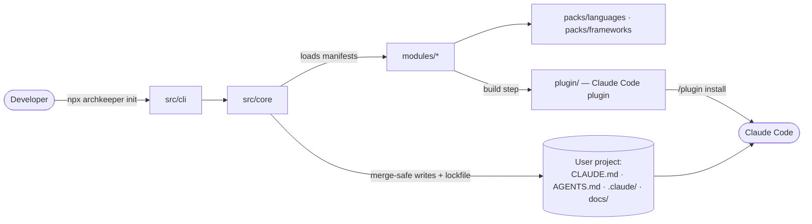

# Architecture map

> The living map of archkeeper. Read it before creating anything new; update it (or run `/update-map`) after adding a
> source layer, module, pack or shared util. Status: **v0.1 M3 `init` works end to end: pure stack detection, the commander CLI with a command registry, the base module, and `init` on M1's renderer and M2's install engine** (see `docs/ROADMAP.md`). Rows marked _planned_ are the agreed target (handoff §8, ADR-0002/0003/0011).

## Overview

- **One source of truth.** Modules hold templates, hooks, skills and agents. The CLI writes hooks, instructions, rules, settings and (by default) skills into the project. From v0.3 the build emits only skills and agents into `plugin/`, never hooks ([ADR-0016](adr/0016-delivery-split.md)).
- **One package, zero runtime dependencies** (ADR-0011). Every library is a devDependency that tsdown inlines. The published `files` are `dist`, `modules`, `packs` and `schema`.
- **Core is pure.** It does module resolution, rendering, merge planning and the lockfile. The CLI owns prompts, output and exit codes.
- **Layers are lint-enforced** (ESLint `no-restricted-*` rules in `eslint.config.mjs`; each is proven by a fixture in `test/fixtures/layers/`):
  - `src/core` never imports `src/cli`, commander or @clack/prompts. It never uses `process` or `console`, whether as a global, through `globalThis`, or imported from `process`, `console` or their `node:` forms, and never imports `fs` or `fs/promises`: callers pass file contents in through an injected reader. It never imports `zlib` either: core hashes blob content, and `src/cli` compresses it. It starts no process and opens no connection (`child_process`, `worker_threads`, `net`, `http`, `https`, `http2` and `dgram` are refused), so stack detection is pure by construction.
  - The install engine splits along that line: `src/core` plans every write and merge purely (`planInstall`), and `src/cli` reads the snapshot and applies the plan transactionally (`install`).
  - `src/hooks` imports only `node:` built-ins and `src/hooks/runtime`.
  - `src/hooks/runtime` imports no npm package.

## Repository layout

| Path                      | Purpose                                                                                                                                                                                      | Status           |
| ------------------------- | -------------------------------------------------------------------------------------------------------------------------------------------------------------------------------------------- | ---------------- |
| `src/cli/`                | npx entry: Node version check, commander, the command registry, `init` and its prompts, the transactional apply                                                                              | active           |
| `src/core/`               | Brand, errors, manifests, config, resolution, renderer, install planner, strategies, lockfile, stack detection                                                                               | active           |
| `src/hooks/`              | Hook sources (one self-contained bundle each) and the shared hook runtime in `src/hooks/runtime/`                                                                                            | _planned v0.1_   |
| `modules/<id>/`           | One switchable feature: `module.json` and `files/`; `modules/presets.json` holds the preset chain                                                                                            | active           |
| `packs/languages/<lang>/` | Language rules, linter configs, detection (TS/JS, Python first)                                                                                                                              | _planned v0.1–2_ |
| `packs/frameworks/<fw>/`  | Framework rules and detection                                                                                                                                                                | _planned v0.2+_  |
| `schema/`                 | JSON Schemas of the config, lock and module manifest, generated from `src/core` (`npm run schema`); published                                                                                | active           |
| `plugin/`                 | Generated Claude Code plugin, kept in the repo for the marketplace; never published to npm (ADR-0016)                                                                                        | _planned v0.3_   |
| `benchmarks/`             | With-vs-without-kit harness (not published)                                                                                                                                                  | _planned v0.2_   |
| `examples/`               | Fixtures `ts-app`, `py-app`, `mixed` for tests and tapes; not linted, formatted, covered or published                                                                                        | active           |
| `scripts/`                | Repo checks and CI gates, license file, tape rendering, release guards and packing; helpers in `lib.mjs`                                                                                     | active           |
| `docs/`                   | This map, decisions/ADRs, roadmap, release runbook (`releasing.md`), feature memories, research                                                                                              | active           |
| `.claude/`                | This repo's own Claude Code setup (dogfooding)                                                                                                                                               | active           |
| `test/`                   | Vitest suites for hooks, scripts and lint rules, plus `helpers.ts`; `fixtures/` is kept out of `npm run lint`; `__snapshots__/` holds the install, per-module and golden-tree file snapshots | active           |
| `.github/`                | CI, release (staged publish), demo-gifs, CodeQL and PR-title workflows; issue forms; Dependabot                                                                                              | active           |
| `.husky/`                 | Git hooks: lint-staged on commit, commitlint on message                                                                                                                                      | active           |
| `.changeset/`             | Changesets config and pending changesets; the maintainer versions locally (ADR-0013)                                                                                                         | active           |

## Index

Add a row whenever something is created. Keep one line per item.

### Source layers

| Path                            | Purpose                                                                                                                                                                               | Key exports                                                                                                                                                           |
| ------------------------------- | ------------------------------------------------------------------------------------------------------------------------------------------------------------------------------------- | --------------------------------------------------------------------------------------------------------------------------------------------------------------------- |
| `src/core/brand.ts`             | The only place the product slug is written; every name, path and marker derives from it                                                                                               | `BRAND`, `Brand`                                                                                                                                                      |
| `src/core/errors.ts`            | `ArchkeeperError` and its subclasses: the message names the file, the JSON path or line, and a `Try:` fix                                                                             | `ArchkeeperError`, `ManifestError`, `ConfigError`, `ResolveError`, `RenderError`, `MergeError`, `PathSafetyError`, `LockError`, `ApplyError`, `UsageError`, `Finding` |
| `src/core/imports.ts`           | `importProblem`: refuses `@` imports of outside or private files (`.env*`, CLAUDE.local.md) wherever Claude Code finds them; `withoutComments` as Claude Code reads text              | `importProblem`, `withoutComments`                                                                                                                                    |
| `src/core/paths.ts`             | Refuses absolute, backslash, `:`, control-character, `..` and trailing-dot paths before any file-system check (#23); targets use portable ASCII names                                 | `relativePathProblem`, `targetPathProblem`, `hasControlCharacter`, `foldedPath`, `RELATIVE_PATH_HINT`, `TARGET_PATH_HINT`                                             |
| `src/core/json.ts`              | Parses JSON with `JSON.parse` and locates the first syntax error with jsonc-parser                                                                                                    | `parseJson`, `JsonResult`, `lineAndColumn`, `parseErrorWords`, `isRecord`                                                                                             |
| `src/core/issues.ts`            | Turns zod's first issue into a finding with a JSON path, a problem and a fix                                                                                                          | `checkSchema`, `describeIssue`, `jsonPath`                                                                                                                            |
| `src/core/schema-parts.ts`      | Shared zod pieces: stacks, kebab ids, option names, one-line text, safe relative paths and portable targets                                                                           | `STACKS`, `Stack`, `kebabId`, `relativePath`, `targetPath`, `described`, `listOf`, `refusing`                                                                         |
| `src/core/manifest-schema.ts`   | The zod contract of `modules/<id>/module.json` and `modules/presets.json` (#18)                                                                                                       | `moduleManifestSchema`, `presetCatalogSchema`, `HOOK_EVENTS`, `ModuleManifest`, `ignoreLineProblem`, `SETTINGS_FILE`, `MCP_FILE`, `GITIGNORE_FILE`                    |
| `src/core/mcp-schema.ts`        | The zod contract of one `.mcp.json` server: `${NAME}`-only env, headers and query values, no credential variables in remote `url` or `headers`                                        | `mcpServerSchema`                                                                                                                                                     |
| `src/core/manifest-rules.ts`    | Cross-field manifest rules: demo or internal, reserved targets, no allow rules, declared files, no repeats                                                                            | `manifestRuleFinding`                                                                                                                                                 |
| `src/core/targets.ts`           | Refuses template targets the kit builds from data or never writes: settings and `.mcp.json` at any depth, `.env*`, `.git`, kit dirs, sidecars                                         | `reservedTarget`, `LOCAL_SETTINGS_FILE`, `KitFolders`                                                                                                                 |
| `src/core/loader.ts`            | Loads modules, their templates and hook scripts, and the preset chain through an injected reader; refuses unknown `conflicts` ids                                                     | `loadModule`, `loadCatalog`, `manifestPath`, `templatePath`, `ReadKitFile`, `KitModule`, `Catalog`                                                                    |
| `src/core/config-schema.ts`     | The zod contract of `.archkeeper/config.json`: version, preset, modules, stack, options, compose (ADR-0014)                                                                           | `configSchema`, `ProjectConfig`, `CONFIG_VERSION`                                                                                                                     |
| `src/core/config.ts`            | Parses the project config: unknown keys warn, invalid values and newer versions throw `ConfigError`; the versioned jsDelivr `$schema` URL a new config gets                           | `parseConfig`, `configPath`, `configSchemaUrl`, `ParsedConfig`                                                                                                        |
| `src/core/options.ts`           | Merges config options over each module's typed defaults; a wrong type throws with the option's description                                                                            | `resolveOptions`, `moduleOptions`, `optionDefaults`, `ResolvedOptions`                                                                                                |
| `src/core/when.ts`              | Evaluates a manifest `when` against the stack and option values, returning the reason it fails                                                                                        | `whenMismatch`, `When`                                                                                                                                                |
| `src/core/resolve.ts`           | Resolves a preset plus `modules.add`/`remove` into modules, adding requirements and leaving out failed `when`s                                                                        | `resolveModules`, `ResolveRequest`, `Resolution`                                                                                                                      |
| `src/core/install-order.ts`     | Topological install order with ties broken by id; a cycle throws `ResolveError` showing it                                                                                            | `installOrder`                                                                                                                                                        |
| `src/core/text.ts`              | Locale-independent string order and LF normalisation, shared by the resolver, the renderer and the hashes; the byte-order mark; the characters no printed lock value may hold         | `compareText`, `asLfText`, `toLf`, `BYTE_ORDER_MARK`, `UNPRINTABLE`, `escapeUnprintable`, `quoted`                                                                    |
| `src/core/template.ts`          | Logic-less `{{a.b}}` templates with `\{{` for a literal `{{`; a list of lines is the one multi-line value; `toImport` writes `@path` imports; `unsafeValue` checks every line         | `renderTemplate`, `brandScope`, `toImport`, `unsafeValue`, `TemplateScope`                                                                                            |
| `src/core/secrets.ts`           | Finds a likely secret (token, key, private key, credentialed URL) by line, never echoing it                                                                                           | `findSecret`, `SecretFinding`                                                                                                                                         |
| `src/core/render-json.ts`       | Builds `.claude/settings.json` (exec-form hooks, permissions) and `.mcp.json` entries from objects                                                                                    | `settingsPart`, `mcpPart`, `hookScriptPath`, `hookArgument`, `toJson`                                                                                                 |
| `src/core/render-tree.ts`       | Groups rendered entries by path in sorted order and refuses two modules writing one file, block or JSON entry                                                                         | `collectEntries`, `RenderTree`, `RenderedEntry`                                                                                                                       |
| `src/core/render.ts`            | Renders modules for a stack, options and brand into a deterministic virtual tree that holds no secret or stray block marker (#20)                                                     | `render`, `RenderContext`                                                                                                                                             |
| `src/core/path-safety.ts`       | Refuses write and delete targets: absolute, drive, UNC, `..`, `\`, `:`, NUL, `.git`/`GIT~1`, Windows device names, trailing dot or space (#23)                                        | `pathSafetyProblem`, `assertSafePath`                                                                                                                                 |
| `src/core/markers.ts`           | The one marker regex `render` refuses in values and the parser reads as markers; marker lines per style; legacy slugs                                                                 | `markerPattern`, `markerIn`, `markerStyle`, `markerLine`, `parseMarker`                                                                                               |
| `src/core/blocks-file.ts`       | Splits a blocks file into user text and blocks, keeping every byte; broken or repeated markers throw `MergeError` with the line                                                       | `parseBlocks`, `emptyBlocks`, `blockParts`, `BlocksFile`                                                                                                              |
| `src/core/blocks-edit.ts`       | Replaces, removes and inserts blocks in the file's EOL and BOM; an `@`-imports block goes first, others are appended                                                                  | `editBlocks`, `BlockEdits`, `NewBlock`                                                                                                                                |
| `src/core/hash.ts`              | sha256 of LF-normalised content, the form of every lock hash and blob name, and of exact bytes                                                                                        | `contentHash`, `exactHash`, `HASH`                                                                                                                                    |
| `src/core/version.ts`           | Semantic-version precedence, for "a kit older than the lock refuses to run"                                                                                                           | `compareVersions`, `SEMVER`                                                                                                                                           |
| `src/core/json-keys.ts`         | The owned-key form of a JSON entry (`$schema`, permission rule, hook by event and script, MCP server) and its container                                                               | `JSON_KEY`, `entryKey`, `SCHEMA_KEY`, `EntryKey`                                                                                                                      |
| `src/core/lock-schema.ts`       | The zod contract of `<state dir>/lock.json` v1, exported to `schema/lock.schema.json`; paths pass path safety, hashes are 64 hex (ADR-0014)                                           | `lockSchema`, `LOCKFILE_VERSION`                                                                                                                                      |
| `src/core/lock.ts`              | Reads the untrusted lock (newer format or kit refused, conflict markers split into sides), writes it with sorted keys, and names the hashes it keeps blobs of                         | `readLock`, `serializeLock`, `emptyLock`, `blobHashes`, `lockFilePath`, `Lock`, `FileEntry`, `BlockEntry`, `Removal`, `KitId`                                         |
| `src/core/lock-rebuild.ts`      | Rebuilds a lock left with conflict markers: newer kit's entries, union of `removed[]`, bases from known content on disk                                                               | `rebuildLock`                                                                                                                                                         |
| `src/core/plan-types.ts`        | The planner's vocabulary: the snapshot, the nine operation kinds, one path's outcome, the `Ownable` predicate                                                                         | `PathState`, `Snapshot`, `OpKind`, `PlanOp`, `PathOutcome`, `Ownable`                                                                                                 |
| `src/core/sidecar.ts`           | Sidecar paths and when a sidecar may be written: missing, unedited kit sidecar, never one the user edited; a skip that moves a lock entry is an adopt                                 | `sidecarPath`, `sidecarAction`, `keptSidecarReason`, `settledOp`, `EntryChange`                                                                                       |
| `src/core/file-plan.ts`         | The owned and create-only strategies: rewrite unchanged, sidecar for user edits and first contact, adopt identical, record deletions                                                  | `planFile`, `FileJob`                                                                                                                                                 |
| `src/core/blocks-plan.ts`       | The blocks strategy: per block against its base; one sidecar per file; deleted blocks go to `removed[]`                                                                               | `planBlocks`, `BlocksJob`                                                                                                                                             |
| `src/core/blocks-unwritable.ts` | A blocks path the kit never writes through (a symlink): unseen kit blocks go to the sidecar as `pending`; a deleted sidecar marks them seen                                           | `planUnwritableBlocks`                                                                                                                                                |
| `src/core/json-entries.ts`      | Finds, hashes (canonical JSON) and edits owned entries through jsonc-parser `modify`, keeping comments and the file's indentation                                                     | `parseDocument`, `findEntry`, `entryHash`, `entryValue`, `containerProblem`, `editDocument`, `formattingOf`                                                           |
| `src/core/json-plan.ts`         | The json strategy: a user's entry under a kit key stays theirs, diverged entries kept, `$schema` only where absent, hooks only for kit scripts                                        | `planJson`, `JsonJob`, `SETTINGS_SCHEMA`                                                                                                                              |
| `src/core/plan.ts`              | The pure install planner (#21): ordered, reasoned operations, the bytes to write and the next lock; adds the kit's `.gitattributes` block                                             | `planInstall`, `snapshotPaths`, `withStateBlock`, `STATE_BLOCK`, `Plan`, `PlanContext`                                                                                |
| `src/core/plan-summary.ts`      | Groups a plan by path as create, modify, conflict (a sidecar) and skip; names the sidecars still waiting, from this run or the lock's `pending` (#27)                                 | `summarizePlan`, `pendingSidecars`, `PathSummary`, `PlanGroup`                                                                                                        |
| `src/core/unified-diff.ts`      | A `diff -u` style unified diff of one file with three lines of context, compared as LF, for `--dry-run`                                                                               | `unifiedDiff`                                                                                                                                                         |
| `src/core/stack-profile.ts`     | Detection's vocabulary: the injected `ProjectView`, languages, tools by job, frameworks, command purposes and the `StackProfile` (#25)                                                | `ProjectView`, `StackProfile`, `DetectedCommand`, `ClaudeSetup`, `TOOL_JOBS`, `PURPOSES`, `recordOf`, `stringsOf`, `inOrder`                                          |
| `src/core/detect.ts`            | Pure stack detection over a `ProjectView`: merges the TS/JS and Python signals, root docs and an existing Claude setup (#25, ADR-0006)                                                | `detectStack`                                                                                                                                                         |
| `src/core/detect-node.ts`       | package.json signals: the manager by package-manager-detector's rules, from the project up to its repository root, tools, frameworks, workspaces, `run` commands of fixed scripts     | `nodeSignals`                                                                                                                                                         |
| `src/core/detect-python.ts`     | Python signals with smol-toml: PEP 621, PEP 735 groups, Poetry and uv tables, requirements*.txt, pylock*.toml; uv, Poetry or pip; malformed TOML is a warning                         | `pythonSignals`                                                                                                                                                       |
| `src/core/project-values.ts`    | The template values detection gives modules: AGENTS.md's commands table and the root docs that exist, as lines (#28)                                                                  | `projectValues`                                                                                                                                                       |
| `src/core/import-blocks.ts`     | Leaves out a rendered `@`-imports block, such as `@AGENTS.md`, that its file or `.claude/CLAUDE.md` already imports outside the kit's blocks (#28)                                    | `withoutImportedBlocks`                                                                                                                                               |
| `src/cli/bin.ts`                | Bundle entry (`dist/cli.mjs`): rejects unsupported Node.js before it imports the program                                                                                              | none (entry)                                                                                                                                                          |
| `src/cli/node-version.ts`       | The supported Node.js range (equal to `engines.node`) and the upgrade message                                                                                                         | `SUPPORTED_NODE_RANGE`, `nodeVersionProblem`                                                                                                                          |
| `src/cli/main.ts`               | commander 15 with `--version`, `--help`, `--cwd`, `--yes`, `--json`, `--debug`; registers every registry command; maps errors to one line, a `Try:` line and the exit codes (#26)     | `main`, `readPackageInfo`, `inCi`, `EXIT_CODES`, `CliOutput`, `PackageInfo`                                                                                           |
| `src/cli/commands.ts`           | The command registry: every command with its demo (tape, README section) or `internal: true`; import-free, so check-demos reads it (#26)                                              | `COMMANDS`, `CommandInfo`, `CommandDemo`                                                                                                                              |
| `src/cli/context.ts`            | What the CLI takes from its surroundings (output, package, kit, brand, cwd, prompts, git), so tests run it in-process                                                                 | `CliContext`, `Session`, `GlobalFlags`, `CommandSetup`, `PackageInfo`                                                                                                 |
| `src/cli/output.ts`             | The process streams styled by `node:util` styleText (NO_COLOR, FORCE_COLOR); `printError` with escaped lines and the stack only with --debug                                          | `PROCESS_OUTPUT`, `printError`, `styled`, `CliOutput`, `StyleFormat`                                                                                                  |
| `src/cli/prompts.ts`            | The `Prompter` init asks through, and its `@clack/prompts` implementation, used only on a terminal                                                                                    | `Prompter`, `CLACK_PROMPTER`, `Choice`                                                                                                                                |
| `src/cli/git-state.ts`          | `git status -- .` and `check-ignore`, with no shell, fsmonitor, optional locks or caller `GIT_*` variables: clean, dirty, not a repository, ignored or unknown                        | `gitState`, `GitState`                                                                                                                                                |
| `src/cli/project-view.ts`       | The project as detection reads it: confined reads, never through a symlink, and the folders above it up to its git repository's root                                                  | `projectView`                                                                                                                                                         |
| `src/cli/init.ts`               | `init` (#27): detect, pick the preset, plan with the config, show it, then the `--dry-run` diff, or the git warning and the yes when the plan writes                                  | `setupInit`                                                                                                                                                           |
| `src/cli/init-answers.ts`       | init's flags and questions: `--stack`, `--modules +id,-id`, the git warning, the preset with its token budget, the yes; scripted runs fail with the flag to pass                      | `checkInitFlags`, `stackFlag`, `moduleChanges`, `goOnWithoutGit`, `choosePreset`, `presetLine`, `confirmApply`, `Asking`                                              |
| `src/cli/init-config.ts`        | Reads `<state dir>/config.json`; when the answers change it, adds it to the plan's writes, keeping unknown keys, so the apply's stale check and rollback cover it                     | `readExistingConfig`, `nextConfig`, `withConfig`, `ExistingConfig`, `NextConfig`                                                                                      |
| `src/cli/init-report.ts`        | init's output: the detected stack, the grouped plan, coloured diffs, waiting sidecars and next steps, every path, entry and reason escaped                                            | `reporterFor`, `detectedLines`, `planLines`, `diffLines`, `sidecarLines`, `nextStepLines`, `Reporter`                                                                 |
| `src/cli/init-run.ts`           | One init run and what it planned; whether applying writes anything (a file, the config, the lock or a blob), which needs a yes                                                        | `InitRun`, `Planned`, `InitFlags`, `textAt`, `writesAnything`                                                                                                         |
| `src/cli/init-finish.ts`        | The end of init: the `--dry-run` diff, or the apply through `install` and its report (exit 2 while a sidecar waits), and the `--json` line                                            | `finishDryRun`, `applyPlanned`                                                                                                                                        |
| `src/cli/kit.ts`                | The CLI's file access for core: finds the package root and loads `modules/` through `loadCatalog`                                                                                     | `packageRoot`, `kitReader`, `readKit`                                                                                                                                 |
| `src/cli/project-files.ts`      | Confines project paths (realpath through symlinked folders stays inside, outside `.git`; a broken link is refused) and reads states without following symlinks (#23)                  | `confinedPath`, `readConfined`, `readSnapshot`, `lstatOrUndefined`, `NO_FOLLOW`, `readFileBytes`                                                                      |
| `src/cli/atomic-files.ts`       | Temp-sibling writes opened `wx` and renamed into place with EPERM/EBUSY retries; deletes of regular files only; folder bookkeeping                                                    | `writeAtomically`, `renameWithRetry`, `removeFile`, `ensureFolder`, `removeFolders`                                                                                   |
| `src/cli/blob-store.ts`         | gzip blobs with an OS-neutral header; reads a blob with a 1 MiB cap and checks it hashes to its name                                                                                  | `compressed`, `readBlob`, `baseFolder`, `MAX_BLOB_BYTES`                                                                                                              |
| `src/cli/backup.ts`             | Per-run backups under `<state dir>/local/backup/<runId>/` (0600 blobs, a manifest of file/symlink/absent), the self-ignoring `local/`, state folders that are never symlinks, restore | `currentPaths`, `backUp`, `restore`, `ensureLocalFolder`, `assertRealStateFolders`, `backupsFolder`, `Backup`, `Saved`                                                |
| `src/cli/apply.ts`              | Applies a plan all-or-nothing (#24): backup, blobs, files, lock last; rollback on any failure; prunes stale blobs and old backups                                                     | `applyPlan`, `ApplyResult`                                                                                                                                            |
| `src/cli/install.ts`            | Reads the lock (rebuilding a conflicted one) and the snapshot and plans; `install` applies that plan or one made earlier, refusing it when stale: what `init` and `update` call       | `install`, `planProject`, `InstallOptions`, `InstallResult`                                                                                                           |

### Modules

Every module is marked `internal` until its milestone ships its README section and GIF; the others are still manifests only. `modules/presets.json` holds the small ⊂ medium ⊂ full chain with SessionStart caps of 1,200, 3,000 and 4,000 characters. Each module has a file snapshot in `test/__snapshots__/modules/`.

| Module             | Purpose                                                                                             | Presets             | Writes                                                                                                     | Hooks |
| ------------------ | --------------------------------------------------------------------------------------------------- | ------------------- | ---------------------------------------------------------------------------------------------------------- | ----- |
| `base`             | CLAUDE.md importing AGENTS.md, agent rules with the detected commands, ignore rules for local files | small, medium, full | blocks in `CLAUDE.md` (`agents-import`, `claude-code`), `AGENTS.md` (`agent-rules`), `.gitignore` (`base`) | none  |
| `safety`           | Guard hooks and native deny rules; option `optOut`                                                  | small, medium, full | _M4_                                                                                                       | _M4_  |
| `feature-memory`   | Per-feature MEMORY.md, mistakes log, memory hooks, `/new-feature`, `/handoff`                       | small, medium, full | _M5_                                                                                                       | _M5_  |
| `knowledge`        | Decisions, ADRs, glossary, `/why`, `/adr`                                                           | medium, full        | _M5_                                                                                                       | none  |
| `architecture-map` | `docs/architecture.md` and `/update-map`                                                            | medium, full        | _M6_                                                                                                       | none  |
| `format-on-edit`   | Formats and lints each edited file with the project's tools                                         | medium, full        | _M6_                                                                                                       | _M6_  |
| `stop-check`       | Runs the project's tests before Claude stops, once turned on                                        | full                | _M6_                                                                                                       | _M6_  |

### Shared utilities

| Path                                                                                                        | Purpose                                                                                                                                                             |
| ----------------------------------------------------------------------------------------------------------- | ------------------------------------------------------------------------------------------------------------------------------------------------------------------- |
| `.claude/hooks/lib.mjs`                                                                                     | Hook helpers: stdin payload, git, feature memory, symlink-safe state IO, `isProjectFile`, `readRegularFile`                                                         |
| `.claude/hooks/shell-words.mjs`, `shell-word-reader.mjs`, `ansi-c-quote.mjs`, `brace-expansion.mjs`         | Linear-time shell tokenizer: quotes, escapes, heredocs, substitutions, brace expansion with a work budget                                                           |
| `.claude/hooks/shell-commands.mjs`, `command-wrappers.mjs`                                                  | Turn tokens into simple commands with pipelines; strip env assignments and wrappers (`sudo`, `env`, `xargs`, `bash -c`, …)                                          |
| `.claude/hooks/shell-syntax.mjs`                                                                            | Import-free shell vocabulary shared by the parser and rules: shell names, value options, `hasExpansion`, `isAssignment`                                             |
| `.claude/hooks/find-expression.mjs`                                                                         | Splits `find` arguments into roots and expression tokens, with each `-exec` segment as one token                                                                    |
| `.claude/hooks/bash-rules.mjs`, `git-rules.mjs`, `dangerous-paths.mjs`, `cli-options.mjs`, `glob-match.mjs` | Guard rules per program (`git`, `chmod`, `gh`, publish, `.env` reads) and how all rules combine                                                                     |
| `.claude/hooks/delete-rules.mjs`                                                                            | `rm` and `find` delete rules: dangerous roots, filters that narrow before `-delete`, `-exec rm` and `find … \| xargs rm`                                            |
| `.claude/hooks/interpreters.mjs`                                                                            | Per-interpreter option specs; reads arguments in order to find inline code, modules, scripts or stdin                                                               |
| `.claude/hooks/inline-code.mjs`                                                                             | Classifies inline code as safe idiom, able to run its input, built from expansions, or opaque                                                                       |
| `.claude/hooks/interpreter-rules.mjs`                                                                       | Denies or asks when a download, or an expansion, supplies the code an interpreter runs                                                                              |
| `.claude/hooks/downloaded-files.mjs`                                                                        | Names of the files `curl`/`wget` write in a command, so running one of them is caught                                                                               |
| `.claude/hooks/piped-scripts.mjs`                                                                           | Judges the text `echo`, `printf` or a here-document pipes into a shell, decoded escapes included; asks when it is hidden                                            |
| `.claude/hooks/verdicts.mjs`                                                                                | `deny`/`ask` verdict builders and `strictest`, shared by the guard rule modules                                                                                     |
| `.claude/hooks/env-files.mjs`                                                                               | `.env` secrets-file and template matching shared by both guards                                                                                                     |
| `.claude/hooks/attribution.mjs`                                                                             | AI-attribution pattern shared by `guard-bash`, `commitlint.config.mjs` and `scripts/check-commit-authors.mjs`                                                       |
| `scripts/lib.mjs`                                                                                           | Shared script helpers: `exitWith`, shell-free `git` and `npm` runners, `gitRevision`, `repositoryFiles`                                                             |
| `scripts/check-comments.mjs`                                                                                | Comment-policy checker (TypeScript AST): commented-out code, dividers, untracked TODOs, comment ratio                                                               |
| `scripts/third-party-licenses.mjs`                                                                          | Writes `dist/THIRD_PARTY_LICENSES.md` from the `<bundle>.inlined.json` lists the build writes from its module graph                                                 |
| `scripts/check-package.mjs`                                                                                 | Package gates: publint, pack-list snapshot, runtime dependencies, install scripts, size budgets, bin smoke                                                          |
| `scripts/check-brand.mjs`                                                                                   | Brand check: no slug literal outside `src/core/brand.ts` and the allowlist; `package.json` `name` and `bin` match `BRAND`                                           |
| `scripts/build-schemas.mjs`                                                                                 | Writes `schema/*.json` with `z.toJSONSchema()` from the zod schemas in `src/core`; `--check` fails when one is stale                                                |
| `scripts/check-changeset.mjs`                                                                               | Changeset gate: a PR that changes `src/`, `modules/`, `packs/` or `schema/` adds a changeset, unless labelled `no-release`                                          |
| `scripts/check-commit-authors.mjs`                                                                          | Commit-author gate: no bot or AI-tool author or co-author (Dependabot only on its own PRs), no `AI_ATTRIBUTION` line                                                |
| `scripts/check-release.mjs`                                                                                 | Release guards: npm ≥ 11.15, tag = `v<version>`, CHANGELOG section, not private, not below npm `latest`; `--dry-run`                                                |
| `scripts/pack-release.mjs`                                                                                  | Packs the release tarball only if the checkout is the tagged commit minus `prepare`; outputs tarball, integrity, shasum                                             |
| `scripts/stage-summary.mjs`                                                                                 | Reads `npm stage publish --json`; prints the shasum to check and the exact `npm stage approve <id>` command                                                         |
| `scripts/check-demos.mjs`                                                                                   | Demo gate: GIF caps (a tape each, ≤ 2 MB, ≤ 20 s or 30 s for a `# hero` tape) and the demo or `internal` of every module and every command in `src/cli/commands.ts` |
| `scripts/demo-rules.mjs`                                                                                    | Demo rule for modules (#18) and commands (#26): exactly one of `demo` or `internal`; a demo has its tape, GIF and README section                                    |
| `scripts/ts-resolve.mjs`                                                                                    | A Node.js resolve hook mapping `./x.js` imports to `.ts`, so plain Node runs `src/` without a build (build-schemas, CLI tests)                                      |
| `scripts/context-rules.mjs` (+ `.d.mts`)                                                                    | Always-on context of a project (ADR-0017): CLAUDE.md and its imports, rules without `paths:`, model-invocable skill descriptions, the SessionStart cap; chars / 4   |
| `scripts/context-budget.mjs`                                                                                | `npm run context`: runs the built CLI's `init --yes` per preset on ts-app, py-app and mixed and fails over `budgets.json` `alwaysOnContext`                         |
| `scripts/render-tapes.mjs`                                                                                  | Fills `{{brand.*}}` in `docs/media/tapes/*.tape`, installs the packed CLI, runs pinned VHS in a fixture copy                                                        |
| `scripts/tape-rules.mjs`                                                                                    | Tape checks with a VHS-faithful tokenizer: refused commands anywhere on a line, Set-only settings, brand placeholders                                               |
| `scripts/pull-gifs.mjs`                                                                                     | `npm run gifs:pull -- <run-id>`: copies a demo-gifs run's feature GIFs into `docs/media/` for the maintainer to commit                                              |
| `test/helpers.ts`                                                                                           | Test helpers: `runScript`, hook verdicts, temp dirs and repos, `git`, `commitFiles`, `fixtureCopy`, `fakeBin`, `gifBytes`                                           |
| `test/kit-fixtures.ts`                                                                                      | Core test data: an in-memory `ReadKitFile`, a rich manifest, the preset chain, the `acmekit` test brand and entry builders                                          |
| `test/plan-fixtures.ts`                                                                                     | Planner test data: a tree builder, snapshots, and `applied`, which applies a plan to a snapshot without IO                                                          |
| `test/install-helpers.ts`                                                                                   | Install test data: the render fixture rendered for the test brand, and `projectText`, a tree listing for file snapshots                                             |
| `test/init-helpers.ts`                                                                                      | `runInit`: init in-process with the test brand, a scripted prompter and a stub git; the `existing-claude-setup` fixture                                             |
| `test/static-rules.ts`                                                                                      | The static rules of generated output (ADR-0015, roadmap): settings keys and exec-form hooks, CLAUDE.md, skill and agent frontmatter                                 |
| `test/fixtures/detect/<case>/`                                                                              | 17 detection fixtures: `project/` (absent for an empty project) and the `expected.json` profile                                                                     |
| `test/secret-samples.ts`                                                                                    | Likely secrets by kind, built at run time, shared by the core secret scan and guard-secrets tests                                                                   |
| `test/fixtures/render/`                                                                                     | Three fixture modules for the renderer's snapshot, property and brand tests; hook bundles live in `hook-bundles/`                                                   |

## This repo's Claude Code setup

| File                              | Role                                                                                                                       |
| --------------------------------- | -------------------------------------------------------------------------------------------------------------------------- |
| `AGENTS.md`                       | Shared rules for every AI tool                                                                                             |
| `CLAUDE.md`                       | Imports `AGENTS.md`, adds Claude-specific notes                                                                            |
| `.claude/settings.json`           | Permissions, attribution off, hook registration (exec form)                                                                |
| `.claude/hooks/session-start.mjs` | Injects in-progress feature "Next step" (and the pre-compaction snapshot after compaction)                                 |
| `.claude/hooks/pre-compact.mjs`   | Saves a branch/changes snapshot to `.claude/state/` before compaction                                                      |
| `.claude/hooks/guard-bash.mjs`    | Parses the command, then denies or asks on dangerous commands, AI attribution, hook skips; asks if it cannot load or parse |
| `.claude/hooks/guard-secrets.mjs` | Denies secrets in writes; asks on `.env*`, new allow-secret lines, new secret lines, and edits it can't check              |
| `.claude/hooks/format-lint.mjs`   | Prettier, ESLint and comment check on each edited file (when installed)                                                    |
| `.claude/hooks/stop-guard.mjs`    | Runs `check:quick` on changed code and asks for a feature-memory update                                                    |
| `.claude/rules/*.md`              | Path-scoped rules: TypeScript, generated files, hooks, tests                                                               |
| `.claude/skills/*`                | `/new-feature`, `/handoff`, `/update-map`, `/adr`, `/why`, `/demo-gif`                                                     |
| `.claude/agents/*`                | `reviewer`, `security-reviewer`                                                                                            |

## Build

`npm run build` runs tsdown (`tsdown.config.mts`, tsdown pinned exactly) and then `scripts/third-party-licenses.mjs`. `dist/` is gitignored.

| Output                         | Source                     | Notes                                                             |
| ------------------------------ | -------------------------- | ----------------------------------------------------------------- |
| `dist/cli.mjs`                 | `src/cli/bin.ts`           | One ESM file with a shebang; the target comes from `engines.node` |
| `dist/hooks/<name>.mjs`        | each `src/hooks/<name>.ts` | One self-contained build per hook; it may inline no npm package   |
| `dist/<bundle>.inlined.json`   | each build's module graph  | The `node_modules` files a bundle inlines; never published        |
| `dist/THIRD_PARTY_LICENSES.md` | the `.inlined.json` lists  | Licenses of every inlined package                                 |

Every bundle may import only `node:` built-ins (tsdown `deps.onlyImport`), so the package needs no runtime dependency. The `inlinedModules` plugin in `tsdown.config.mts` lists every `node_modules` file in each build's module graph (#71); package.json `files` excludes the lists. `jsonc-parser` is aliased to its ESM build (reference §7.1). CI builds twice, the second time from a fresh copy in another directory, and compares sha256 sums. Its `node-gate` job runs `dist/cli.mjs` on Node.js 18, 20, 22.17.0 and 23 (upgrade message, exit 1) and on 22.17.1 (`--version` works).

## Package gates

`npm run package` (`scripts/check-package.mjs`) checks the built package against `budgets.json`, the lightness contract (ADR-0017):

- publint passes, with warnings treated as errors.
- The `npm pack --dry-run` file list matches the committed `scripts/package-files.txt` (`npm run package -- --update` after an intended change).
- `dependencies`, `optionalDependencies` and `peerDependencies` stay within the runtime-dependency budget (0), and there is no `preinstall`, `install` or `postinstall` script.
- With `--release`, `prepare` counts as an install script too, and `publishConfig` or a package-root `.npmrc` fails the check, since either could override the registry, tag, access or auth the workflow passes. The release workflow deletes husky's dev-only `prepare` (`npm pkg delete scripts.prepare`) and then checks the manifest it publishes this way.
- The tarball and each `dist/hooks/*.mjs` bundle stay within their size budgets.
- The built bin answers `--version` with the package version, and `--help`.
- `budgets.json` itself defines every budget as a non-negative number.

CI also runs `npm publish --dry-run` and installs the packed tarball under a path with a space on ubuntu, macOS and Windows.

`npm run context` (`scripts/context-budget.mjs`, after the build in `npm run check` and in the CI `Package checks` job) holds each preset's always-on context to `budgets.json` `alwaysOnContext`: small 1,500, medium 3,000 and full 4,500 tokens (ADR-0017), SessionStart counted at its cap. `test/context-budget.test.ts` checks the same in-process.

## In a user's project

`init` (M3) runs the install engine (M2) and writes these, as its modules arrive. What it writes, and the decision that governs each part:

| Path                                                     | Strategy                     | Contract                                                                              |
| -------------------------------------------------------- | ---------------------------- | ------------------------------------------------------------------------------------- |
| `CLAUDE.md`, `AGENTS.md`, `.gitignore`, `.gitattributes` | Managed blocks               | [ADR-0014](adr/0014-on-disk-contract.md); the kit's own `base-blobs` attributes block |
| `.claude/settings.json`, `.mcp.json`                     | Kit-owned JSON entries       | ADR-0014; hook registration and deny rules in [ADR-0015](adr/0015-hook-runtime.md)    |
| `.claude/hooks/archkeeper/*.mjs`                         | Owned                        | ADR-0015                                                                              |
| `.claude/rules/archkeeper/`, `.claude/skills/<name>/`    | Owned                        | ADR-0014; skills move to the plugin only with `--skills plugin` (ADR-0016)            |
| `docs/` feature memory, decisions, map                   | Create-only                  | ADR-0014                                                                              |
| `.archkeeper/config.json`, `lock.json`, `base/`          | Committed kit state          | ADR-0014                                                                              |
| `.archkeeper/local/`                                     | Gitignored state and backups | ADR-0014, ADR-0015; its own `.gitignore` of `*`; the last 3 backup runs, mode 0600    |
| `<path>.archkeeper-new` beside a kit file                | Sidecar: the kit's version   | ADR-0014; from `init` or `update`, committed, never loaded by Claude Code             |

Every name and path comes from `BRAND` ([ADR-0012](adr/0012-brand-constants.md)). `init`, `update`, `uninstall`, `doctor` and every hook stay offline, and the kit has no telemetry ([ADR-0018](adr/0018-offline-no-telemetry.md)). The one process `init` starts is a local `git status`, to warn when git cannot undo its changes.

`init` exits 0 when done, 1 on an error or a cancel, and 2 when done with sidecars to review. A new `config.json` gets `$schema` `https://cdn.jsdelivr.net/npm/<npm name>@<version>/schema/config.schema.json`, the schema of the kit version that wrote it.

## Conventions

- Brand: never write the product slug. Import `BRAND` from `src/core/brand.ts` ([ADR-0012](adr/0012-brand-constants.md)). Core APIs that need a name, path or marker take `brand: Brand` as a parameter that defaults to `BRAND`, so tests can pass another brand and a rename touches one file.
- Feature work: `docs/features/<feature>/MEMORY.md`, using the template in `docs/features/_template/`.
- Decisions: `docs/decisions.md` index, with one ADR per big decision in `docs/adr/`.
- Failures not to repeat: `docs/mistakes.md`. Terms: `docs/glossary.md`.
