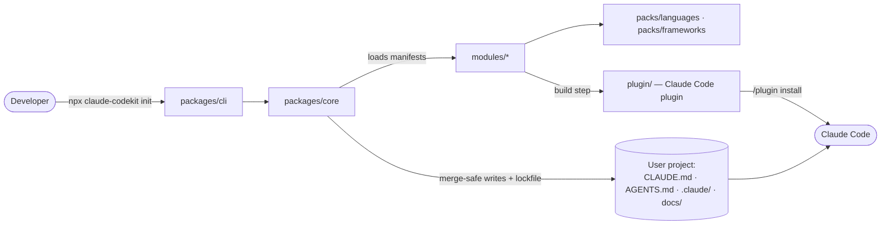

# Architecture map

> The living map of claude-codekit. Read it before creating anything new; update it (or run `/update-map`) after adding a
> package, module, pack or shared util. Status: **pre-code**. The layout below is the agreed target (handoff §8, ADR-0002/0003).

## Overview

- **One source of truth.** Modules hold templates, hooks, skills and agents. The CLI scaffolds the project-owned parts. The build emits the plugin-owned parts into `plugin/`.
- **Core is pure.** It does module resolution, rendering, merge planning and the lockfile. The CLI owns prompts, output and exit codes.

## Repository layout

| Path                      | Purpose                                                                                | Status           |
| ------------------------- | -------------------------------------------------------------------------------------- | ---------------- |
| `packages/cli/`           | npx entry: `init`, `update`, `doctor`, `uninstall`                                     | _planned v0.1_   |
| `packages/core/`          | Module loader, manifest schema, stack detection, renderer, merge-safe writer, lockfile | _planned v0.1_   |
| `packages/dashboard/`     | Local web dashboard                                                                    | _planned v0.4_   |
| `modules/<name>/`         | One switchable feature: `manifest`, `templates/`, `hooks/`, `skills/`, `agents/`       | _planned v0.1_   |
| `packs/languages/<lang>/` | Language rules, linter configs, detection (TS/JS, Python first)                        | _planned v0.1–2_ |
| `packs/frameworks/<fw>/`  | Framework rules and detection                                                          | _planned v0.2+_  |
| `plugin/`                 | Generated Claude Code plugin (`.claude-plugin/plugin.json`, skills, agents, hooks)     | _planned v0.1_   |
| `benchmarks/`             | With-vs-without-kit harness                                                            | _planned v0.2_   |
| `examples/`               | Fixture projects for tests and demo GIFs                                               | _planned v0.1_   |
| `scripts/`                | Repo tooling (comment-policy check, release helpers)                                   | _planned v0.1_   |
| `docs/`                   | This map, decisions/ADRs, roadmap, feature memories, research                          | active           |
| `.claude/`                | This repo's own Claude Code setup (dogfooding)                                         | active           |

## Index

Add a row whenever something is created. Keep one line per item.

### Packages

| Package    | Purpose | Key exports |
| ---------- | ------- | ----------- |
| _none yet_ |         |             |

### Modules

| Module     | Purpose | Presets | Writes | Hooks |
| ---------- | ------- | ------- | ------ | ----- |
| _none yet_ |         |         |        |       |

### Shared utilities

| Path                    | Purpose                                                                     |
| ----------------------- | --------------------------------------------------------------------------- |
| `.claude/hooks/lib.mjs` | Hook helpers: stdin payload, git, feature-memory lookup, `.claude/state` IO |

## This repo's Claude Code setup

| File                              | Role                                                                                       |
| --------------------------------- | ------------------------------------------------------------------------------------------ |
| `AGENTS.md`                       | Shared rules for every AI tool                                                             |
| `CLAUDE.md`                       | Imports `AGENTS.md`, adds Claude-specific notes                                            |
| `.claude/settings.json`           | Permissions, attribution off, hook registration (exec form)                                |
| `.claude/hooks/session-start.mjs` | Injects in-progress feature "Next step" (and the pre-compaction snapshot after compaction) |
| `.claude/hooks/pre-compact.mjs`   | Saves a branch/changes snapshot to `.claude/state/` before compaction                      |
| `.claude/hooks/guard-bash.mjs`    | Denies or asks on dangerous shell commands, AI attribution, `--no-verify`                  |
| `.claude/hooks/guard-secrets.mjs` | Denies writes containing secrets; asks before editing `.env*`                              |
| `.claude/hooks/format-lint.mjs`   | Prettier, ESLint and comment check on each edited file (when installed)                    |
| `.claude/hooks/stop-guard.mjs`    | Runs `check:quick` on changed code and asks for a feature-memory update                    |
| `.claude/rules/*.md`              | Path-scoped rules: TypeScript, generated files, hooks, tests                               |
| `.claude/skills/*`                | `/new-feature`, `/handoff`, `/update-map`, `/adr`, `/why`, `/demo-gif`                     |
| `.claude/agents/*`                | `reviewer`, `security-reviewer`                                                            |

## Conventions

- Feature work: `docs/features/<feature>/MEMORY.md`, using the template in `docs/features/_template/`.
- Decisions: `docs/decisions.md` index, with one ADR per big decision in `docs/adr/`.
- Failures not to repeat: `docs/mistakes.md`. Terms: `docs/glossary.md`.
